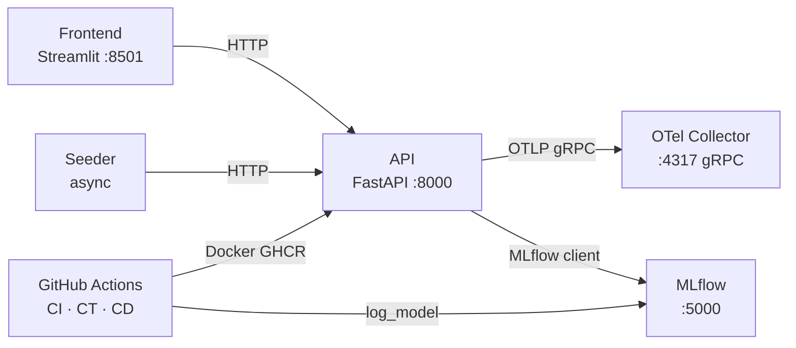

# PipelineModeling

Pipeline de ML continuo: clasificación binaria (Breast Cancer Wisconsin), reentrenamiento incremental (`partial_fit`), versionado MLflow, telemetría OTel, observabilidad Prometheus + Grafana, CI/CD GitHub Actions.

---

## Quick Start

```bash
python manage.py setup   # crea .venv, instala deps, entrena modelo inicial
python manage.py start   # arranca stack completo
python manage.py stop    # para todo
```

| URL | Servicio |
|---|---|
| http://localhost:8501 | Frontend — Streamlit |
| http://localhost:8000/docs | API — Swagger UI |
| http://localhost:5000 | MLflow — Model Registry |
| http://localhost:3000 | Grafana — dashboards |
| http://localhost:9090 | Prometheus — métricas |
| http://localhost:55679 | OTel Collector — zPages |
| http://localhost:13133 | OTel Collector — healthcheck |

---

## Dataset

| Propiedad | Valor |
|---|---|
| Fuente | `sklearn.datasets.load_breast_cancer()` |
| Muestras | 569 · Features: 30 · Clases: 0 = maligno, 1 = benigno |

---

## Arquitectura



**API** (FastAPI + SGDClassifier vía `BasePredictor`) · **Frontend** (Streamlit) · **Seeder** (tráfico sintético + drift) · **MLflow** (Model Registry) · **OTel Collector** (telemetría)

---

## CLI `manage.py`

```
python manage.py setup                          Primera configuración
python manage.py start                          Arrancar stack
python manage.py stop                           Parar servicios
python manage.py status                         Estado de los servicios
python manage.py test                           Suite completa pytest
python manage.py test --unit                    Solo unitarios
python manage.py test --integration             Solo integración
python manage.py test --frontend                E2E Playwright
python manage.py simulate --scenario drift      Simular deriva
python manage.py simulate --scenario chaos      Inyectar errores
python manage.py simulate --scenario all        Todos los escenarios
```

### Pipeline de entrenamiento manual

```bash
gh workflow run ct.yml --repo VSXR/PipelineModeling --ref master
gh run watch --repo VSXR/PipelineModeling
```

Umbrales de promoción: accuracy ≥ 0.85 · f1 ≥ 0.82 · roc_auc ≥ 0.90

### Tests E2E del frontend

```bash
playwright install chromium   # solo la primera vez
python manage.py test --frontend
```

---

## Documentación

| Documento | Contenido |
|---|---|
| [docs/architecture.md](docs/architecture.md) | Componentes, ModelManager, PipelineMetrics, DriftTracker, modos de despliegue |
| [docs/api.md](docs/api.md) | Referencia completa de endpoints con ejemplos |
| [docs/ops.md](docs/ops.md) | Setup, variables de entorno, desarrollo local, problemas frecuentes |
| [docs/cicd.md](docs/cicd.md) | Workflows ci/ct/cd — triggers, umbrales, secretos |
| [docs/versioning.md](docs/versioning.md) | ModelTrainer, ModelPromoter, aliases MLflow, hot-swap, rollback |
| [docs/monitoring.md](docs/monitoring.md) | Métricas OTel, alertas Prometheus, OTel Collector config |
| [docs/testing.md](docs/testing.md) | Suite pytest: unitarios, integración, observabilidad |
| [docs/dataset.md](docs/dataset.md) | Dataset Breast Cancer Wisconsin, features, métricas del modelo |
| [docs/crisp-dm.md](docs/crisp-dm.md) | Mapeo CRISP-DM al proyecto |
