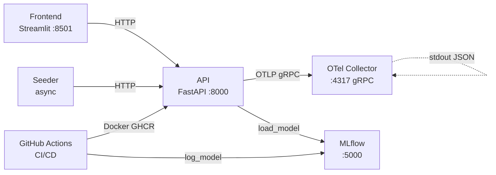

# PipelineModeling

Sistema de aprendizaje continuo para clasificación binaria. Implementa el ciclo completo de CRISP-DM sobre el dataset **Breast Cancer Wisconsin**: inferencia en tiempo real, reentrenamiento incremental (`partial_fit`), versionado de artefactos con MLflow Model Registry, telemetría con OpenTelemetry, observabilidad local con Prometheus + Grafana y CI/CD con GitHub Actions.

---

## Quick Start

```bash
# 1. Primera vez: crea .venv, instala dependencias y entrena el modelo inicial
python manage.py setup

# 2. Arranca el stack completo (Docker: MLflow · OTel Collector; Local: API · Frontend · Seeder)
python manage.py start

# 3. Cuando termines
python manage.py stop
```

| URL | Servicio |
|---|---|
| http://localhost:8501 | Frontend — panel declarativo |
| http://localhost:8000/docs | API — Swagger UI |
| http://localhost:3000 | Grafana — dashboards |
| http://localhost:5000 | MLflow — Model Registry |
| http://localhost:9090 | Prometheus — consultas |
| http://localhost:55679 | OTel Collector — zPages |

---

## Dataset

El proyecto usa el **Breast Cancer Wisconsin (Diagnostic)** dataset:

| Propiedad | Valor |
|---|---|
| Fuente | `sklearn.datasets.load_breast_cancer()` |
| Muestras | 569 |
| Features | 30 (medidas de núcleos celulares) |
| Clases | 0 = maligno, 1 = benigno |
| Métricas baseline | accuracy ≈ 0.833, f1 ≈ 0.857 |

Ver [docs/dataset.md](docs/dataset.md) para la documentación completa del dataset y la metodología CRISP-DM.

---

## Arquitectura



Cinco componentes: **API** (FastAPI + SGDClassifier vía `BasePredictor`), **Frontend** (Streamlit), **Seeder** (tráfico sintético + drift), **MLflow** (Model Registry), **OTel Collector** (telemetría). En modo local, los tres primeros corren en `.venv`; MLflow y el Collector en Docker.

---

## CLI `manage.py`

```
python manage.py setup                                          Primera configuración
python manage.py start                                          Arrancar todo el workspace
python manage.py stop                                           Parar todos los servicios
python manage.py status                                         Estado de los servicios
python manage.py test                                           Suite completa de tests (112 tests)
python manage.py test --unit                                    Solo tests unitarios (95 tests, sin API)
python manage.py test --integration                             Solo tests de integración (requiere API corriendo)
python manage.py simulate --scenario drift                      Simular deriva de datos (7 min)
python manage.py simulate --scenario version-fail               Simular fallo de cambio de versión
python manage.py simulate --scenario training-errors            Simular errores de entrenamiento (7 min)
python manage.py simulate --scenario chaos                      Inyectar errores en inferencias (4 min)
python manage.py simulate --scenario all                        Ejecutar todos los escenarios
```

**Suite de Tests** — ver [docs/testing.md](docs/testing.md):
- Tests unitarios: health, inference, training, versioning, metrics, flow
- Tests de integración de observabilidad: Collector → Prometheus → Grafana (requieren stack Docker)

---

## Documentación

| Documento | Contenido |
|---|---|
| [docs/architecture.md](docs/architecture.md) | Arquitectura detallada, PipelineMetrics, DriftTracker, MLflow |
| [docs/api.md](docs/api.md) | Referencia completa de endpoints con ejemplos de 30 features |
| [docs/dataset.md](docs/dataset.md) | Dataset, CRISP-DM, análisis exploratorio, métricas del modelo |
| [docs/crisp-dm.md](docs/crisp-dm.md) | Metodología CRISP-DM aplicada paso a paso al proyecto |
| [docs/versioning.md](docs/versioning.md) | Flujo MLflow + GitHub Actions, hot-swap, rollback |
| [docs/monitoring.md](docs/monitoring.md) | Métricas OTel, OTel Collector, exportadores SaaS |
| [docs/testing.md](docs/testing.md) | Suite completa de tests: unitarios, integración y observabilidad (Prometheus/Grafana) |
| [docs/setup.md](docs/setup.md) | Prerrequisitos, primera configuración, variables de entorno |
| [docs/development.md](docs/development.md) | Flujo de desarrollo, Docker Compose, solución de problemas |
| [docs/cicd.md](docs/cicd.md) | Pipeline CI/CD — retrain, validate, publish |

---

## Estructura del proyecto

```
PipelineModeling/
├── manage.py                     # CLI unificado (setup · start · stop · status · test · simulate)
├── docker-compose.yml            # Stack Docker (MLflow · OTel Collector · API · Seeder · Frontend)
├── .env.example
├── model/
│   ├── train.py                  # Entrenamiento (breast_cancer, 30 features, SGDClassifier)
│   ├── metrics.json              # accuracy, f1, precision, recall
│   └── weights/model.pkl         # Artefacto (.gitignore, gestionado por MLflow)
├── services/
│   ├── api/
│   │   ├── core/
│   │   │   ├── predictor.py      # BasePredictor ABC + SKLearnPredictor
│   │   │   ├── drift.py          # DriftTracker singleton (EMA, OTel emission)
│   │   │   ├── metrics.py        # PipelineMetrics facade (OTel MeterProvider)
│   │   │   └── model_manager.py  # Singleton; asyncio locks; hot-swap MLflow
│   │   ├── routers/              # inference · training · versioning
│   │   └── schemas/              # InferenceRequest/Response, TrainingRequest/Response
│   ├── frontend/
│   │   ├── app.py                # Punto de entrada Streamlit (wrapper limpio)
│   │   ├── runtime.py            # UI declarativa Streamlit (4 tabs: Inference · Training · Versioning · Metrics & Debug)
│   │   ├── controller.py         # Lógica de negocio (orquestación)
│   │   ├── network.py            # Límite de red (async/sync bridge)
│   │   └── domain.py             # Modelo de estado inmutable
│   ├── seeder/seeder.py          # 3 corutinas async: infer, train, drift
│   └── wrapper/client.py         # PipelineClient (async context manager)
├── monitoring/
│   ├── otel-collector/           # otel-collector.yml (OTLP receivers + Prometheus exporter)
│   ├── prometheus/               # prometheus.yml (scrape config)
│   └── grafana/                  # Provisioning datasources + dashboards JSON
├── .github/workflows/            # retrain.yml · deploy.yml (CI/CD)
├── tests/                        # pytest: 95 unit + 17 observability integration tests
└── docs/                         # Documentación completa
```
