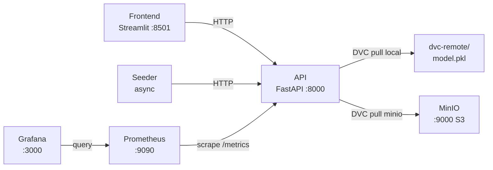

# PipelineModeling

Sistema de aprendizaje continuo para clasificación binaria. Implementa el ciclo completo de CRISP-DM sobre el dataset **Breast Cancer Wisconsin**: inferencia en tiempo real, reentrenamiento incremental (`partial_fit`), versionado de artefactos con DVC + Git, almacenamiento S3-compatible (MinIO) y monitorización con Prometheus y Grafana.

---

## Quick Start

```powershell
# 1. Primera vez: instala dependencias, crea .env y entrena el modelo inicial
.\pipeline.ps1 setup

# 2. Arranca todo el workspace (API · Frontend · Seeder · MinIO · Prometheus · Grafana)
.\pipeline.ps1 start

# 3. Cuando termines
.\pipeline.ps1 stop
```

| URL | Servicio |
|---|---|
| http://localhost:8501 | Frontend — panel de control |
| http://localhost:8000/docs | API — Swagger UI |
| http://localhost:9090 | Prometheus |
| http://localhost:3000 | Grafana (`admin` / ver `.env`) |
| http://localhost:9001 | MinIO — consola web |

---

## Dataset

El proyecto usa el **Breast Cancer Wisconsin (Diagnostic)** dataset:

| Propiedad | Valor |
|---|---|
| Fuente | `sklearn.datasets.load_breast_cancer()` |
| Muestras | 569 |
| Features | 30 (medidas de núcleos celulares) |
| Clases | 0 = maligno, 1 = benigno |
| Métricas baseline | accuracy ≈ 0.833, f1 ≈ 0.857 |

Ver [docs/dataset.md](docs/dataset.md) para la documentación completa del dataset y la metodología CRISP-DM.

---

## Arquitectura



Seis componentes: **API** (FastAPI + SGDClassifier vía `BasePredictor`), **Frontend** (Streamlit, 3 modos de entrada), **Seeder** (tráfico sintético + drift), **MinIO** (remote S3 para DVC), **Prometheus** y **Grafana**. En modo local, los tres primeros corren en `.venv`; los restantes en Docker.

---

## CLI `pipeline.ps1`

```
.\pipeline.ps1 setup                                          Primera configuración
.\pipeline.ps1 start                                          Arrancar todo
.\pipeline.ps1 stop                                           Parar todo
.\pipeline.ps1 status                                         Estado de servicios
.\pipeline.ps1 test                                           Suite de integración (52 tests)
.\pipeline.ps1 train -Version v2.0.0 -RandomState 42         Entrenar y versionar (remote local)
.\pipeline.ps1 train -Version v2.1.0 -RandomState 7 -Remote minio  Versionar en MinIO
```

---

## Documentación

| Documento | Contenido |
|---|---|
| [docs/dataset.md](docs/dataset.md) | Dataset, CRISP-DM, análisis exploratorio, métricas del modelo |
| [docs/crisp-dm.md](docs/crisp-dm.md) | Metodología CRISP-DM aplicada paso a paso al proyecto |
| [docs/setup.md](docs/setup.md) | Prerrequisitos, primera configuración, variables de entorno |
| [docs/architecture.md](docs/architecture.md) | Arquitectura detallada, BasePredictor, DriftTracker, MinIO |
| [docs/api.md](docs/api.md) | Referencia completa de endpoints con ejemplos de 30 features |
| [docs/versioning.md](docs/versioning.md) | Flujo DVC + Git, `pipeline.ps1 train`, hot-swap, remotes |
| [docs/monitoring.md](docs/monitoring.md) | Métricas Prometheus, dashboards Grafana, alertas de drift |
| [docs/testing.md](docs/testing.md) | Suite de 52 tests, cómo ejecutarlos, cómo añadir nuevos |
| [docs/development.md](docs/development.md) | Flujo de desarrollo, Docker Compose, solución de problemas |

---

## Estructura del proyecto

```
PipelineModeling/
├── pipeline.ps1                  # CLI unificado
├── docker-compose.yml            # Stack completo (incluye MinIO)
├── docker-compose.override.yml   # Override local (Prometheus → host.docker.internal)
├── dvc.yaml / dvc.lock           # Pipeline y hashes de artefactos DVC
├── .env.example
├── model/
│   ├── train.py                  # Entrenamiento (breast_cancer, 30 features, SGDClassifier)
│   ├── metrics.json              # accuracy, f1, precision, recall (DVC metrics)
│   ├── plots/confusion_matrix.csv
│   └── weights/model.pkl         # Artefacto (.gitignore, gestionado por DVC)
├── services/
│   ├── api/
│   │   ├── core/
│   │   │   ├── predictor.py      # BasePredictor ABC + SKLearnPredictor
│   │   │   ├── drift.py          # DriftTracker singleton (EMA, /infer/ + /train/)
│   │   │   ├── metrics.py        # Definiciones Prometheus (8 métricas)
│   │   │   └── model_manager.py  # Singleton; asyncio locks; hot-swap DVC
│   │   ├── routers/              # inference · training · versioning
│   │   └── schemas/              # InferenceRequest/Response, TrainingRequest/Response
│   ├── frontend/app.py           # Streamlit (3 tabs: inferencia, entrenamiento, versiones)
│   ├── seeder/seeder.py          # 3 corutinas async: infer, train, drift
│   └── wrapper/client.py         # PipelineClient (async context manager)
├── monitoring/
│   ├── prometheus/               # prometheus.yml · alerts.yml
│   └── grafana/provisioning/     # datasource + dashboard auto-provisionados
├── tests/                        # 52 tests de integración (pytest + httpx)
└── docs/                         # Documentación completa
```
