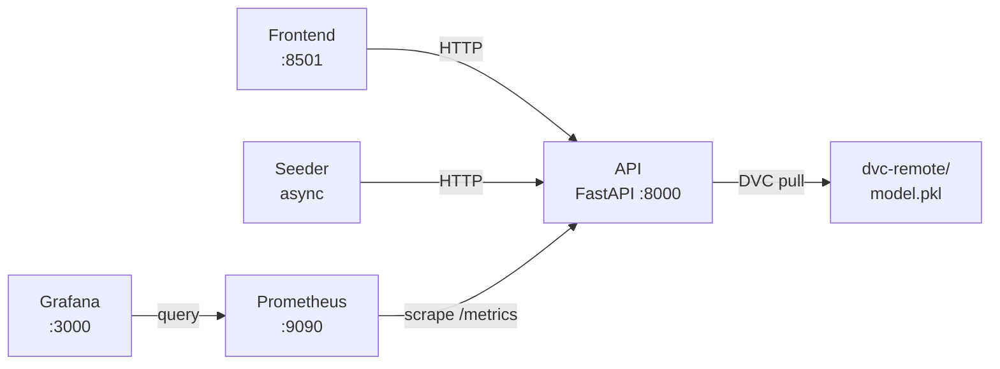

# PipelineModeling

Sistema de aprendizaje continuo para modelos de clasificación. Integra inferencia en tiempo real, reentrenamiento incremental (`partial_fit`), versionado de artefactos con DVC + Git y monitorización con Prometheus y Grafana.

---

## Quick Start

```powershell
# 1. Primera vez: instala dependencias, crea .env y entrena el modelo inicial
.\pipeline.ps1 setup

# 2. Arranca todo el workspace (API · Frontend · Seeder · Prometheus · Grafana)
.\pipeline.ps1 start

# 3. Cuando termines
.\pipeline.ps1 stop
```

| URL | Servicio |
|---|---|
| http://localhost:8501 | Frontend — panel de control |
| http://localhost:8000/docs | API — Swagger UI |
| http://localhost:9090 | Prometheus |
| http://localhost:3000 | Grafana (`admin` / ver `.env`) |

---

## Arquitectura



Cinco componentes: **API** (FastAPI + SGDClassifier), **Frontend** (Streamlit), **Seeder** (generador de tráfico y drift), **Prometheus** y **Grafana**. En modo local, los tres primeros corren en `.venv` con hot-reload; los dos últimos en Docker.

---

## CLI `pipeline.ps1`

```
.\pipeline.ps1 setup                                  Primera configuración
.\pipeline.ps1 start                                  Arrancar todo
.\pipeline.ps1 stop                                   Parar todo
.\pipeline.ps1 status                                 Estado de servicios
.\pipeline.ps1 test                                   Suite de integración (52 tests)
.\pipeline.ps1 train -Version v1.3.0 -NSamples 8000  Entrenar y versionar
```

---

## Documentación

| Documento | Contenido |
|---|---|
| [docs/setup.md](docs/setup.md) | Prerrequisitos, primera configuración, variables de entorno |
| [docs/architecture.md](docs/architecture.md) | Arquitectura detallada, servicios, componentes clave |
| [docs/api.md](docs/api.md) | Referencia completa de endpoints con ejemplos |
| [docs/versioning.md](docs/versioning.md) | Flujo DVC + Git, `pipeline.ps1 train`, hot-swap |
| [docs/monitoring.md](docs/monitoring.md) | Métricas Prometheus, dashboards Grafana, alertas |
| [docs/testing.md](docs/testing.md) | Suite de tests, cómo ejecutarlos, cómo añadir nuevos |
| [docs/development.md](docs/development.md) | Flujo de desarrollo, iteración, solución de problemas |

---

## Estructura del proyecto

```
PipelineModeling/
├── pipeline.ps1                  # CLI unificado
├── docker-compose.yml
├── docker-compose.override.yml   # Override local (Prometheus → host.docker.internal)
├── dvc.yaml / dvc.lock           # Pipeline y hashes de artefactos DVC
├── .env.example
├── model/
│   ├── train.py                  # Entrenamiento bootstrap
│   └── weights/model.pkl         # Artefacto (.gitignore, gestionado por DVC)
├── services/
│   ├── api/                      # FastAPI · core/ · routers/ · schemas/
│   ├── frontend/                 # Streamlit
│   ├── seeder/                   # Generador de tráfico async
│   └── wrapper/                  # PipelineClient (Python async)
├── monitoring/
│   ├── prometheus/               # prometheus.yml · prometheus-local.yml · alerts.yml
│   └── grafana/provisioning/     # datasource + dashboard auto-provisionados
├── tests/                        # 52 tests de integración (pytest + httpx)
└── docs/                         # Documentación detallada
```
