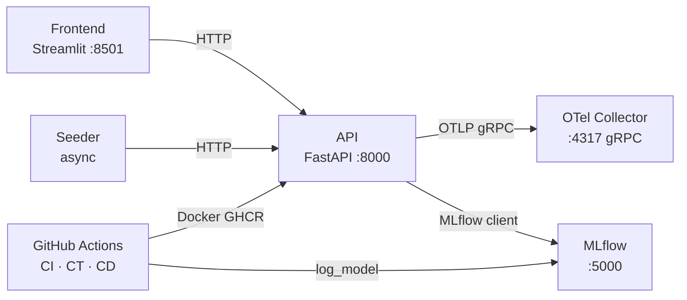

# PipelineModeling

Sistema de aprendizaje continuo para clasificación binaria. Implementa el ciclo completo de CRISP-DM sobre el dataset **Breast Cancer Wisconsin**: inferencia en tiempo real, reentrenamiento incremental (`partial_fit`), versionado de artefactos con MLflow Model Registry, telemetría con OpenTelemetry, observabilidad con Prometheus + Grafana y CI/CD con GitHub Actions.

---

## Quick Start

```bash
# 1. Primera vez: crea .venv, instala dependencias y entrena el modelo inicial
python manage.py setup

# 2. Arranca el stack completo
python manage.py start

# 3. Cuando termines
python manage.py stop
```

| URL | Servicio |
|---|---|
| http://localhost:8501 | Frontend — panel de control MLOps |
| http://localhost:8000/docs | API — Swagger UI |
| http://localhost:5000 | MLflow — Model Registry y Tracking |
| http://localhost:3000 | Grafana — dashboards de observabilidad |
| http://localhost:9090 | Prometheus — consultas de métricas |
| http://localhost:55679 | OTel Collector — zPages |
| http://localhost:13133 | OTel Collector — healthcheck extension |

---

## Dataset

Breast Cancer Wisconsin (Diagnostic):

| Propiedad | Valor |
|---|---|
| Fuente | `sklearn.datasets.load_breast_cancer()` |
| Muestras | 569 |
| Features | 30 (medidas de núcleos celulares) |
| Clases | 0 = maligno, 1 = benigno |

---

## Arquitectura



Cinco componentes: **API** (FastAPI + SGDClassifier vía `BasePredictor`), **Frontend** (Streamlit), **Seeder** (tráfico sintético + drift), **MLflow** (Model Registry), **OTel Collector** (telemetría).

---

## Pipeline de entrenamiento

El entrenamiento está encapsulado en dos clases (`model/trainer.py`, `model/promote.py`):

```
ModelTrainer.train()  →  registra run en MLflow (params + 5 métricas + tags git)
                      →  asigna alias "Staging" en Model Registry
ModelPromoter.promote() →  valida accuracy ≥ 0.85 · f1 ≥ 0.82 · roc_auc ≥ 0.90
                        →  asigna alias "Production" si supera umbrales
```

---

## CLI `manage.py`

```
python manage.py setup                                     Primera configuración
python manage.py start                                     Arrancar stack + runner GH Actions (Windows)
python manage.py stop                                      Parar servicios + terminar runner
python manage.py status                                    Estado de los servicios
python manage.py test                                      Suite completa de pytest
python manage.py test --unit                               Solo tests unitarios (sin API)
python manage.py test --integration                        Solo tests de integración
python manage.py test --frontend                           Tests E2E Playwright (requiere stack activo)
python manage.py simulate --scenario drift                 Simular deriva de datos
python manage.py simulate --scenario version-fail          Simular fallo de cambio de versión
python manage.py simulate --scenario training-errors       Simular errores de entrenamiento
python manage.py simulate --scenario chaos                 Inyectar errores en inferencias
python manage.py simulate --scenario all                   Todos los escenarios
```

### Disparar el pipeline de entrenamiento

Los tres workflows (`ci.yml`, `ct.yml`, `cd.yml`) corren en runners `ubuntu-latest` de GitHub; no requieren runner local. Para ejecutar el pipeline de entrenamiento manualmente:

```bash
gh workflow run ct.yml --repo VSXR/PipelineModeling --ref master
gh run watch --repo VSXR/PipelineModeling
```

`manage.py start` lanza opcionalmente el runner local de Windows si `C:\actions-runner\run.cmd` existe (o la ruta configurada en `ACTIONS_RUNNER_DIR`). Es silencioso en Linux/macOS y solo relevante para desarrollo local avanzado.

### Tests E2E del frontend

Requiere Playwright instalado (solo la primera vez después de `setup`):

```bash
playwright install chromium
python manage.py test --frontend
```

---

## Documentación

| Documento | Contenido |
|---|---|
| [docs/architecture.md](docs/architecture.md) | Componentes, ModelManager, PipelineMetrics, DriftTracker, sincronización MLflow ↔ Docker |
| [docs/cicd.md](docs/cicd.md) | Workflows `ci.yml`, `ct.yml`, `cd.yml` — triggers, umbrales, configuración de secretos |
| [docs/versioning.md](docs/versioning.md) | `ModelTrainer`, `ModelPromoter`, aliases MLflow, hot-swap, rollback |
| [docs/api.md](docs/api.md) | Referencia completa de endpoints con ejemplos |
| [docs/monitoring.md](docs/monitoring.md) | Métricas OTel, OTel Collector, exportadores |
| [docs/testing.md](docs/testing.md) | Suite de tests: unitarios, integración, observabilidad (Prometheus/Grafana) |
| [docs/setup.md](docs/setup.md) | Prerrequisitos, primera configuración, variables de entorno |
| [docs/development.md](docs/development.md) | Flujo de desarrollo, Docker Compose, resolución de problemas |
| [docs/dataset.md](docs/dataset.md) | Dataset Breast Cancer Wisconsin, análisis exploratorio |
| [docs/crisp-dm.md](docs/crisp-dm.md) | Metodología CRISP-DM aplicada al proyecto |

---

## Estructura del proyecto

```
PipelineModeling/
├── manage.py                     # CLI unificado
├── docker-compose.yml            # Stack Docker (MLflow · OTel · API · Frontend · Seeder)
├── .env.example
├── model/
│   ├── trainer.py                # ModelTrainer (train + MLflow log + alias Staging)
│   ├── promote.py                # ModelPromoter (valida umbrales + alias Production)
│   ├── train.py                  # Entry point: orquesta ModelTrainer + ModelPromoter
│   ├── requirements.txt
│   ├── metrics.json
│   └── weights/model.pkl
├── services/
│   ├── api/                      # FastAPI: inference · training · versioning
│   ├── frontend/                 # Streamlit: 4 tabs (Inference · Training · Versioning · Metrics)
│   ├── seeder/                   # Tráfico sintético + drift
│   └── wrapper/                  # PipelineClient async
├── monitoring/
│   ├── otel-collector/
│   ├── prometheus/
│   └── grafana/
├── .github/workflows/
│   ├── ci.yml                    # Lint (ruff) + tests unitarios
│   ├── ct.yml                    # Entrenamiento continuo + promote + GitHub Release
│   └── cd.yml                    # Build Docker + push GHCR + smoke test
├── tests/                        # pytest: unitarios + observabilidad
└── docs/
```
