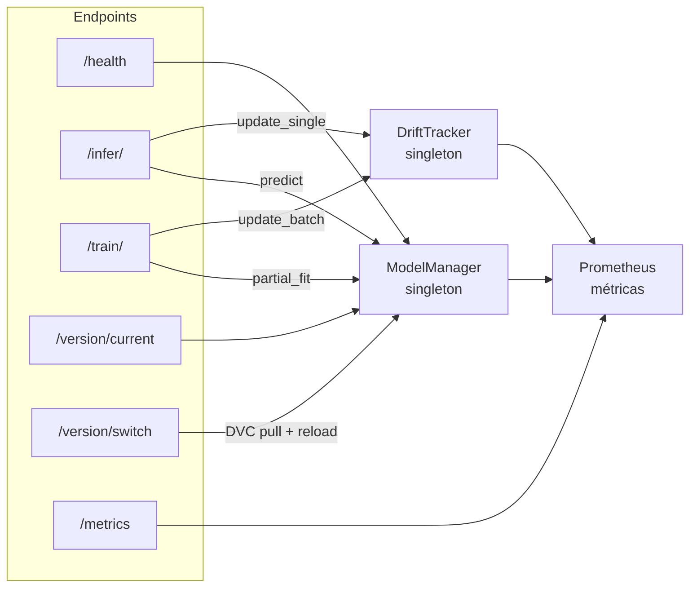

# API Reference

Base URL: `http://localhost:8000`  
Documentación interactiva: http://localhost:8000/docs



> El dataset utilizado es **Breast Cancer Wisconsin** (30 features). Todos los ejemplos usan vectores reales de este dataset. Ver [dataset.md](dataset.md).

---

## GET /health

Estado del servicio y versión activa del modelo.

**Respuesta 200**
```json
{
  "status": "ok",
  "model_loaded": true,
  "model_version": "2026-05-07T09:57:46.806313+00:00"
}
```

```powershell
Invoke-RestMethod http://localhost:8000/health
```

---

## POST /infer/

Predicción binaria sobre un vector de 30 features (breast cancer).  
Además de clasificar, actualiza el buffer de drift del `DriftTracker` (emite cada 50 llamadas).

**Request**
```json
{
  "features": [
    17.99, 10.38, 122.80, 1001.0, 0.1184, 0.2776, 0.3001, 0.1471, 0.2419, 0.0787,
     1.095,  0.905,   8.589,  153.4, 0.0064, 0.0490, 0.0537, 0.0159, 0.0300, 0.0062,
    25.38,  17.33,  184.60, 2019.0, 0.1622, 0.6656, 0.7119, 0.2654, 0.4601, 0.1189
  ],
  "request_id": "req-abc-123"
}
```

| Campo | Tipo | Requerido | Descripción |
|---|---|---|---|
| `features` | `float[]` | Sí | Vector de 30 features (orden: mean → se → worst). Acepta cualquier longitud. |
| `request_id` | `string` | No | ID opcional para correlación; se devuelve sin modificar |

**Respuesta 200**
```json
{
  "prediction": 0,
  "probability": [1.0, 0.0],
  "model_version": "2026-05-07T09:57:46.806313+00:00",
  "request_id": "req-abc-123"
}
```

| Campo | Tipo | Descripción |
|---|---|---|
| `prediction` | `int` | Clase predicha: **0 = maligno**, **1 = benigno** |
| `probability` | `float[2]` | `[P(maligno), P(benigno)]`; suman 1.0 |
| `model_version` | `string` | Timestamp ISO de la última actualización del modelo |

**Errores**
| Código | Causa |
|---|---|
| 422 | `features` vacío, no es lista plana, o falta el campo |
| 503 | Modelo no cargado (durante hot-swap) |
| 500 | Error interno de sklearn |

```powershell
$body = @{
    features = @(17.99, 10.38, 122.80, 1001.0, 0.1184, 0.2776, 0.3001, 0.1471, 0.2419, 0.0787,
                  1.095,  0.905,   8.589,  153.4, 0.0064, 0.0490, 0.0537, 0.0159, 0.0300, 0.0062,
                 25.38,  17.33,  184.60, 2019.0, 0.1622, 0.6656, 0.7119, 0.2654, 0.4601, 0.1189)
} | ConvertTo-Json -Compress
Invoke-RestMethod -Method Post http://localhost:8000/infer/ -ContentType "application/json" -Body $body
```

---

## POST /train/

Reentrenamiento incremental con `partial_fit`. Actualiza el modelo en memoria, guarda el `.pkl` y actualiza la referencia EMA del `DriftTracker`.

**Request**
```json
{
  "features": [
    [17.99, 10.38, 122.80, 1001.0, 0.1184, 0.2776, 0.3001, 0.1471, 0.2419, 0.0787,
      1.095,  0.905,   8.589,  153.4, 0.0064, 0.0490, 0.0537, 0.0159, 0.0300, 0.0062,
     25.38,  17.33,  184.60, 2019.0, 0.1622, 0.6656, 0.7119, 0.2654, 0.4601, 0.1189],
    [13.54, 14.36,  87.46,  566.3, 0.0977, 0.0811, 0.0634, 0.0332, 0.1743, 0.0540,
      0.374,  0.613,   2.540,   34.7, 0.0079, 0.0152, 0.0181, 0.0071, 0.0176, 0.0028,
     15.11,  19.26,  99.70,  711.2, 0.1440, 0.1773, 0.2390, 0.0880, 0.3060, 0.0659]
  ],
  "labels": [0, 1]
}
```

| Campo | Tipo | Requerido | Descripción |
|---|---|---|---|
| `features` | `float[][]` | Sí | Matriz N × 30; mínimo 1 fila |
| `labels` | `int[]` | Sí | Etiquetas binarias (0=maligno, 1=benigno); `len` debe coincidir |

**Respuesta 200**
```json
{
  "status": "ok",
  "samples_trained": 2,
  "model_version": "2026-05-07T10:35:00.000000+00:00"
}
```

**Errores**
| Código | Causa |
|---|---|
| 422 | Batch vacío, listas anidadas inválidas, o `len(features) != len(labels)` |
| 503 | Modelo no cargado |

---

## GET /version/current

Versión y estado de carga del modelo activo.

**Respuesta 200**
```json
{
  "version": "2026-05-07T09:57:46.806313+00:00",
  "model_loaded": true
}
```

```powershell
Invoke-RestMethod http://localhost:8000/version/current
```

---

## POST /version/switch

Hot-swap del modelo a un git ref via DVC. No requiere reiniciar la API. Registra la duración del pull en `pipeline_model_load_duration_seconds`.

**Request**
```json
{ "git_ref": "v2.0.0" }
```

| Campo | Tipo | Requerido | Descripción |
|---|---|---|---|
| `git_ref` | `string` | Sí | Tag semántico, rama o SHA de Git |

**Respuesta 200**
```json
{
  "status": "ok",
  "previous_version": "2026-05-07T09:57:46.806313+00:00",
  "current_version": "2026-05-05T08:00:00.000000+00:00"
}
```

**Errores**
| Código | Causa |
|---|---|
| 422 | `git_ref` vacío o falta el body |
| 500 | Ref no existe, fallo de `git checkout`, fallo de `dvc pull` |

```powershell
Invoke-RestMethod -Method Post http://localhost:8000/version/switch `
    -ContentType "application/json" `
    -Body '{"git_ref": "v2.0.0"}'
```

---

## GET /metrics

Métricas en formato Prometheus text. Ver [monitoring.md](monitoring.md) para la referencia completa.

```powershell
Invoke-WebRequest http://localhost:8000/metrics | Select-Object -ExpandProperty Content
```

---

## Wrapper Python (async)

`services/wrapper/client.py` expone un cliente async que abstrae las llamadas HTTP:

```python
import asyncio
from services.wrapper.client import PipelineClient

FEATURES_30 = [
    17.99, 10.38, 122.80, 1001.0, 0.1184, 0.2776, 0.3001, 0.1471, 0.2419, 0.0787,
     1.095,  0.905,   8.589,  153.4, 0.0064, 0.0490, 0.0537, 0.0159, 0.0300, 0.0062,
    25.38,  17.33,  184.60, 2019.0, 0.1622, 0.6656, 0.7119, 0.2654, 0.4601, 0.1189,
]

async def main():
    async with PipelineClient("http://localhost:8000") as c:
        result = await c.infer(FEATURES_30)
        print(result.prediction, result.probability)
        # 0  [1.0, 0.0]  → maligno con alta confianza

        await c.train(
            features=[FEATURES_30, FEATURES_30],
            labels=[0, 1]
        )

        await c.switch_version("v2.0.0")

asyncio.run(main())
```

---

## Orden de los 30 features

```python
FEATURE_NAMES = [
    # media de 10 propiedades
    "radius_mean", "texture_mean", "perimeter_mean", "area_mean",
    "smoothness_mean", "compactness_mean", "concavity_mean", "concpts_mean",
    "symmetry_mean", "fracdim_mean",
    # error estándar
    "radius_se", "texture_se", "perimeter_se", "area_se",
    "smoothness_se", "compactness_se", "concavity_se", "concpts_se",
    "symmetry_se", "fracdim_se",
    # peor valor (media de los 3 mayores)
    "radius_worst", "texture_worst", "perimeter_worst", "area_worst",
    "smoothness_worst", "compactness_worst", "concavity_worst", "concpts_worst",
    "symmetry_worst", "fracdim_worst",
]
```
