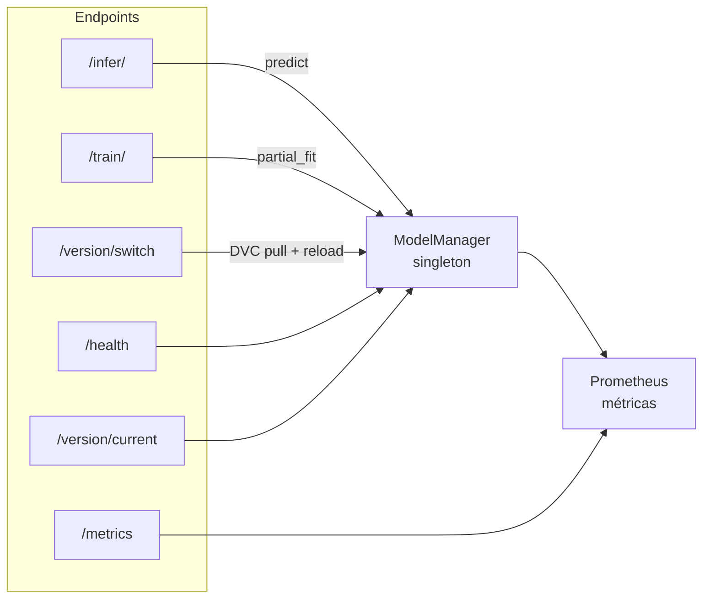

# API Reference

Base URL: `http://localhost:8000`  
Documentación interactiva: http://localhost:8000/docs



---

## GET /health

Estado del servicio y versión activa del modelo.

**Respuesta 200**
```json
{
  "status": "ok",
  "model_loaded": true,
  "model_version": "2024-01-15T10:30:00+00:00"
}
```

```bash
curl http://localhost:8000/health
```

---

## POST /infer/

Predicción sobre un vector de features.

**Request**
```json
{
  "features": [0.1, -0.2, 0.5, 1.0, -0.3, 0.8, 0.0, -1.2, 0.4, 0.7],
  "request_id": "opcional-uuid"
}
```

| Campo | Tipo | Requerido | Descripción |
|---|---|---|---|
| `features` | `float[]` | Sí | Vector de features (mínimo 1 elemento, plano) |
| `request_id` | `string` | No | ID opcional; se devuelve en la respuesta para correlación |

**Respuesta 200**
```json
{
  "prediction": 1,
  "probability": [0.23, 0.77],
  "model_version": "2024-01-15T10:30:00+00:00",
  "request_id": "opcional-uuid"
}
```

**Errores**
| Código | Causa |
|---|---|
| 422 | `features` vacío, no es lista plana, o falta el campo |
| 503 | Modelo no cargado |
| 500 | Error interno de sklearn |

```bash
curl -X POST http://localhost:8000/infer/ \
  -H "Content-Type: application/json" \
  -d '{"features": [0.1, -0.2, 0.5, 1.0, -0.3, 0.8, 0.0, -1.2, 0.4, 0.7]}'
```

---

## POST /train/

Reentrenamiento incremental con `partial_fit`. Actualiza el modelo en memoria y guarda el `.pkl`.

**Request**
```json
{
  "features": [
    [0.1, -0.2, 0.5, 1.0, -0.3, 0.8, 0.0, -1.2, 0.4, 0.7],
    [1.0,  0.5, -0.3, 0.2, 0.8, -0.1, 0.4, 0.9, -0.6, 0.3]
  ],
  "labels": [0, 1]
}
```

| Campo | Tipo | Requerido | Descripción |
|---|---|---|---|
| `features` | `float[][]` | Sí | Matriz de features (N × F), mínimo 1 fila |
| `labels` | `int[]` | Sí | Etiquetas binarias (0 o 1); len debe coincidir con features |

**Respuesta 200**
```json
{
  "status": "ok",
  "samples_trained": 2,
  "model_version": "2024-01-15T10:35:00+00:00"
}
```

**Errores**
| Código | Causa |
|---|---|
| 422 | Batch vacío, listas anidadas inválidas, o `len(features) != len(labels)` |
| 503 | Modelo no cargado |

```bash
curl -X POST http://localhost:8000/train/ \
  -H "Content-Type: application/json" \
  -d '{
    "features": [[0.1, -0.2, 0.5, 1.0, -0.3, 0.8, 0.0, -1.2, 0.4, 0.7]],
    "labels": [1]
  }'
```

---

## GET /version/current

Versión y estado de carga del modelo activo.

**Respuesta 200**
```json
{
  "version": "2024-01-15T10:30:00+00:00",
  "model_loaded": true
}
```

```bash
curl http://localhost:8000/version/current
```

---

## POST /version/switch

Hot-swap del modelo a un git ref via DVC. No requiere reiniciar la API.

**Request**
```json
{ "git_ref": "v1.0.0" }
```

| Campo | Tipo | Requerido | Descripción |
|---|---|---|---|
| `git_ref` | `string` | Sí | Tag, rama o SHA de Git (mínimo 1 carácter) |

**Respuesta 200**
```json
{
  "status": "ok",
  "previous_version": "2024-01-15T10:30:00+00:00",
  "current_version": "2024-01-10T08:00:00+00:00"
}
```

**Errores**
| Código | Causa |
|---|---|
| 422 | `git_ref` vacío o falta el body |
| 500 | Ref no existe, fallo de `git checkout`, fallo de `dvc pull` |

```bash
curl -X POST http://localhost:8000/version/switch \
  -H "Content-Type: application/json" \
  -d '{"git_ref": "v1.0.0"}'
```

---

## GET /metrics

Métricas en formato Prometheus text. Ver [monitoring.md](monitoring.md) para la referencia completa.

```bash
curl http://localhost:8000/metrics
```

---

## Wrapper Python (async)

`services/wrapper/client.py` expone un cliente async:

```python
import asyncio
from services.wrapper.client import PipelineClient

async def main():
    async with PipelineClient("http://localhost:8000") as c:
        result = await c.infer([0.1, -0.2, 0.5, 1.0, -0.3, 0.8, 0.0, -1.2, 0.4, 0.7])
        print(result.prediction, result.probability)

        await c.train(
            features=[[0.1] * 10, [-0.5] * 10],
            labels=[0, 1]
        )

        await c.switch_version("v1.0.0")

asyncio.run(main())
```
