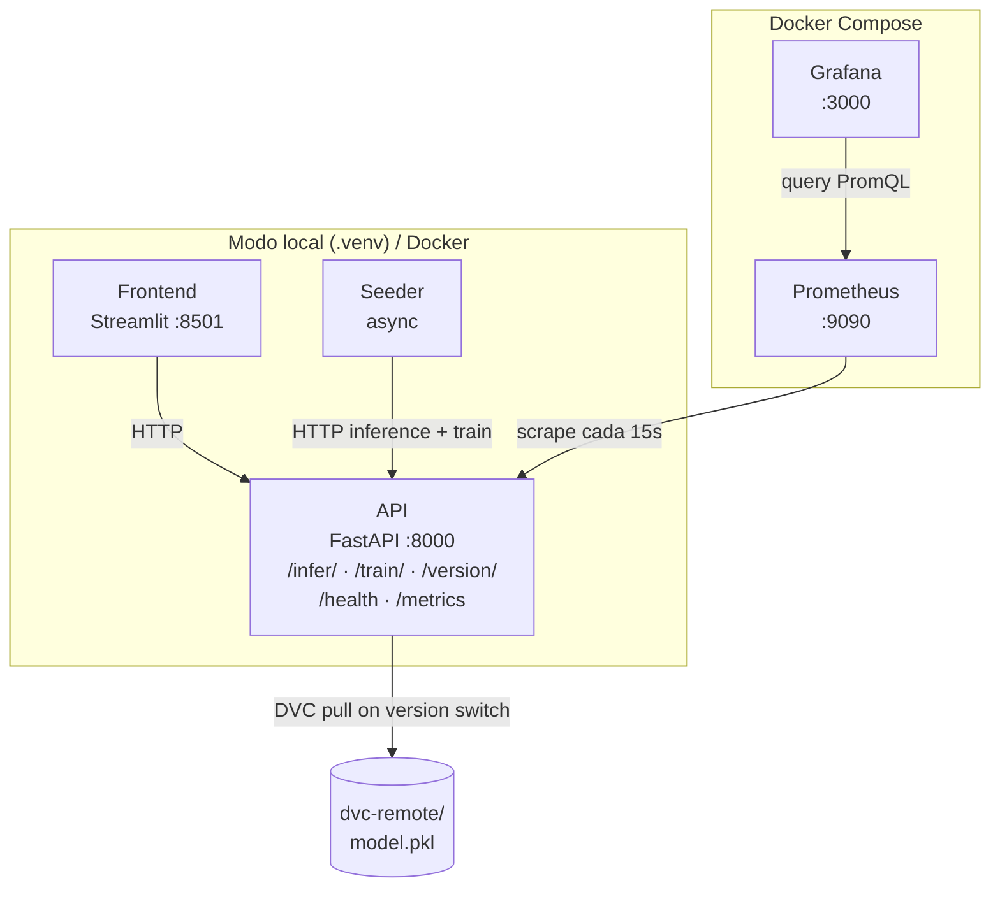
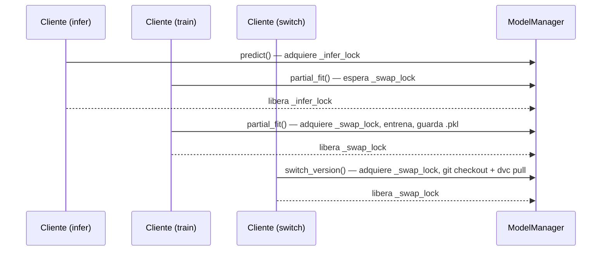

# Arquitectura

## Visión general

PipelineModeling implementa un pipeline de ML continuo con cinco componentes:



---

## Servicios

| Servicio | Puerto | Runtime | Descripción |
|---|---|---|---|
| **API** | 8000 | `.venv` / Docker | FastAPI: inferencia, entrenamiento, versionado |
| **Frontend** | 8501 | `.venv` / Docker | Streamlit: panel de control visual |
| **Seeder** | — | `.venv` / Docker | Generador de tráfico sintético y drift |
| **Prometheus** | 9090 | Docker | Base de datos de series temporales |
| **Grafana** | 3000 | Docker | Dashboards y alertas |

---

## Estructura de directorios

```
PipelineModeling/
├── pipeline.ps1                  # CLI unificado (setup/start/stop/status/test/train)
├── docker-compose.yml            # Stack completo en Docker
├── docker-compose.override.yml   # Override local: Prometheus → host.docker.internal
├── dvc.yaml                      # Pipeline DVC: stage train → model.pkl
├── dvc.lock                      # Hashes de artefactos (rastreado por Git)
├── .env.example                  # Plantilla de variables de entorno
├── dvc-remote/                   # Remote DVC local (.gitignore)
├── model/
│   ├── train.py                  # Entrenamiento bootstrap (SGDClassifier)
│   ├── requirements.txt
│   ├── metrics.json              # Salida de métricas DVC
│   └── weights/model.pkl         # Artefacto gestionado por DVC (.gitignore)
├── services/
│   ├── api/
│   │   ├── main.py               # App FastAPI + lifespan + /health
│   │   ├── core/
│   │   │   ├── config.py         # Pydantic Settings
│   │   │   ├── metrics.py        # Definiciones Prometheus
│   │   │   └── model_manager.py  # Singleton; asyncio locks; hot-swap DVC
│   │   ├── routers/
│   │   │   ├── inference.py      # POST /infer/
│   │   │   ├── training.py       # POST /train/ + drift EMA
│   │   │   └── versioning.py     # GET/POST /version/
│   │   └── schemas/
│   │       ├── inference.py      # InferenceRequest / InferenceResponse
│   │       ├── training.py       # TrainingRequest / TrainingResponse
│   │       └── versioning.py     # VersionSwitch*, VersionCurrentResponse
│   ├── frontend/app.py           # Dashboard Streamlit
│   ├── seeder/seeder.py          # 3 corutinas async: infer, train, drift
│   └── wrapper/client.py         # PipelineClient (async context manager)
├── monitoring/
│   ├── prometheus/
│   │   ├── prometheus.yml        # Scrape targets (Docker: api:8000)
│   │   ├── prometheus-local.yml  # Scrape targets (local: host.docker.internal:8000)
│   │   └── alerts.yml            # Reglas de alerta
│   └── grafana/provisioning/
│       ├── dashboards/pipeline.json
│       └── datasources/datasource.yml
└── tests/
    ├── conftest.py               # Fixture httpx.Client session-scoped
    ├── test_health.py            # 4 tests
    ├── test_inference.py         # 11 tests
    ├── test_training.py          # 12 tests
    ├── test_versioning.py        # 7 tests
    ├── test_metrics.py           # 7 tests
    └── test_flow.py              # 8 tests (golden path E2E)
```

---

## Componentes clave de la API

### ModelManager (singleton)

Gestiona el ciclo de vida del modelo con dos locks asyncio:

- `_infer_lock` — protege lecturas concurrentes (inferencia); múltiples lectores simultáneos
- `_swap_lock` — serializa escrituras (entrenamiento + hot-swap de versión)

La inferencia nunca bloquea al entrenamiento ni viceversa (patrón reader-writer).



### Detección de drift (EMA)

`routers/training.py` mantiene una media de referencia por feature que se actualiza con cada batch de entrenamiento usando una media móvil exponencial (α = 0.05):

```
score_i = |batch_mean_i - ref_mean_i| / (|ref_mean_i| + ε)
ref_mean = 0.95 · ref_mean + 0.05 · batch_mean
```

El score se emite como métrica Prometheus `pipeline_data_drift_score{feature="fi"}`.

### Hot-swap de versiones

`POST /version/switch` ejecuta en un executor thread:
1. `git checkout <ref> -- .dvc`
2. `git checkout <ref> -- dvc.lock`
3. `dvc pull --force --remote local`
4. Recarga `model.pkl` con `joblib.load`

Si el pull falla, el modelo en memoria se preserva y la métrica `MODEL_LOADED` se restaura a 1.

---

## Modos de despliegue

| Modo | API / Frontend / Seeder | Prometheus / Grafana | Cuándo usarlo |
|---|---|---|---|
| **Local** (`pipeline.ps1 start`) | `.venv` con `--reload` | Docker | Desarrollo, iteración rápida |
| **Docker Compose** (`docker compose up`) | Contenedores | Docker | Integración, entrega, demo |
