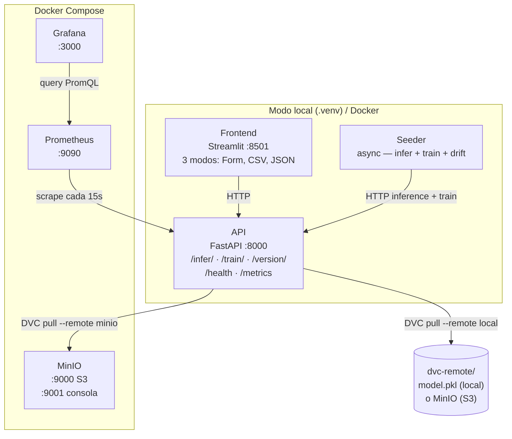
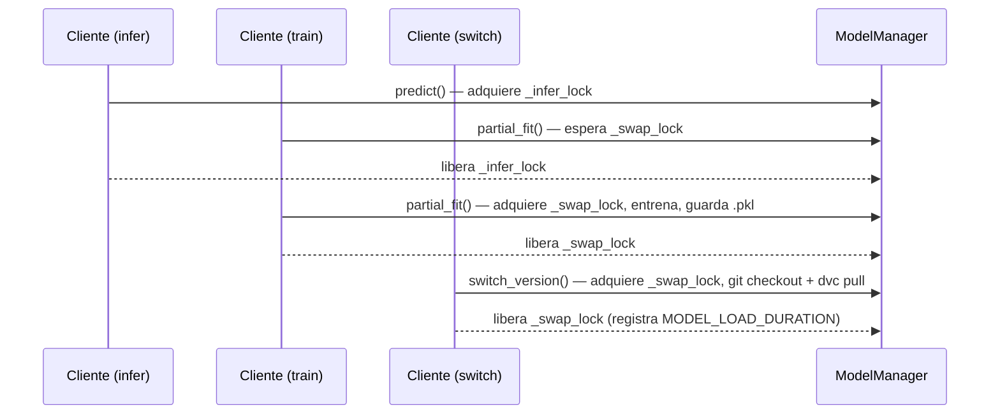
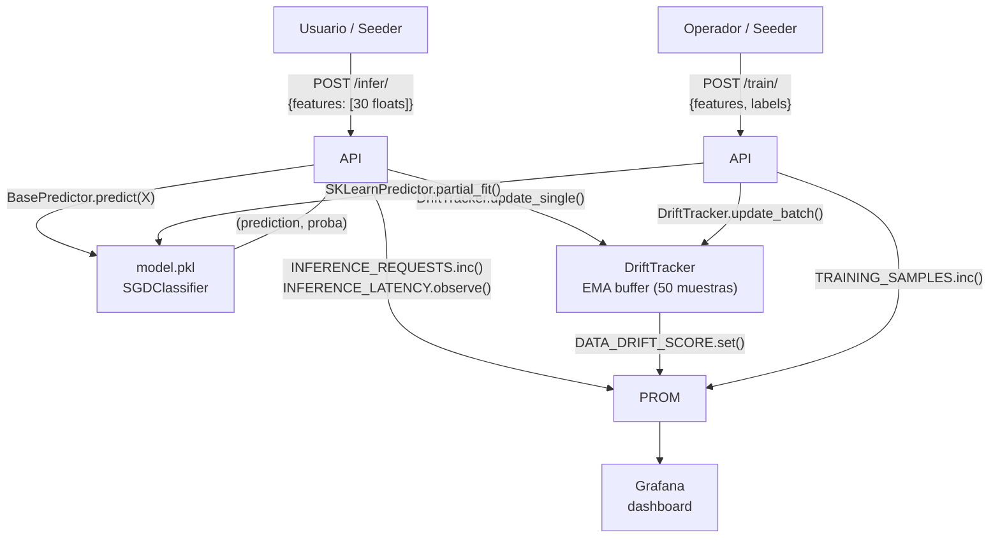

# Arquitectura

## Visión general

PipelineModeling implementa un pipeline de ML continuo con seis componentes siguiendo la metodología CRISP-DM:



---

## Servicios

| Servicio | Puerto | Runtime | Descripción |
|---|---|---|---|
| **API** | 8000 | `.venv` / Docker | FastAPI: inferencia, entrenamiento incremental, versionado |
| **Frontend** | 8501 | `.venv` / Docker | Streamlit: Form / CSV upload / JSON upload |
| **Seeder** | — | `.venv` / Docker | Generador de tráfico sintético y drift simulado |
| **MinIO** | 9000 / 9001 | Docker | Remote S3 compatible para artefactos DVC |
| **Prometheus** | 9090 | Docker | Base de datos de series temporales (8 métricas) |
| **Grafana** | 3000 | Docker | Dashboards y alertas auto-provisionados |

---

## Estructura de directorios

```
PipelineModeling/
├── pipeline.ps1                  # CLI unificado (setup/start/stop/status/test/train)
├── docker-compose.yml            # Stack completo (MinIO + API + Frontend + Seeder + Prometheus + Grafana)
├── docker-compose.override.yml   # Override local: Prometheus → host.docker.internal
├── dvc.yaml                      # Pipeline DVC: stage train → model.pkl
├── dvc.lock                      # Hashes de artefactos (rastreado por Git)
├── .env.example                  # Plantilla de variables de entorno
├── .dvc/config                   # Remotes DVC (local + minio)
├── dvc-remote/                   # Remote DVC local (.gitignore)
├── model/
│   ├── train.py                  # Entrenamiento bootstrap (breast_cancer, SGDClassifier)
│   ├── requirements.txt          # scikit-learn, joblib, dvc-s3
│   ├── metrics.json              # accuracy, f1, precision, recall (DVC metrics)
│   ├── plots/confusion_matrix.csv
│   └── weights/model.pkl         # Artefacto gestionado por DVC (.gitignore)
├── services/
│   ├── api/
│   │   ├── main.py               # App FastAPI + lifespan + /health
│   │   ├── core/
│   │   │   ├── config.py         # Pydantic Settings
│   │   │   ├── predictor.py      # BasePredictor (ABC) + SKLearnPredictor
│   │   │   ├── drift.py          # DriftTracker singleton (EMA, 30 features)
│   │   │   ├── metrics.py        # 8 métricas Prometheus
│   │   │   └── model_manager.py  # Singleton; asyncio locks; hot-swap DVC
│   │   ├── routers/
│   │   │   ├── inference.py      # POST /infer/ + DriftTracker.update_single()
│   │   │   ├── training.py       # POST /train/ + DriftTracker.update_batch()
│   │   │   └── versioning.py     # GET/POST /version/ + MODEL_LOAD_DURATION
│   │   └── schemas/
│   │       ├── inference.py      # InferenceRequest / InferenceResponse
│   │       ├── training.py       # TrainingRequest / TrainingResponse
│   │       └── versioning.py     # VersionSwitch*, VersionCurrentResponse
│   ├── frontend/app.py           # Streamlit (3 tabs: inferencia, entrenamiento, versiones)
│   ├── seeder/seeder.py          # 3 corutinas async: infer, train, drift
│   └── wrapper/client.py         # PipelineClient (async context manager)
├── monitoring/
│   ├── prometheus/
│   │   ├── prometheus.yml        # Scrape targets (Docker: api:8000)
│   │   ├── prometheus-local.yml  # Scrape targets (local: host.docker.internal:8000)
│   │   └── alerts.yml            # 4 reglas de alerta
│   └── grafana/provisioning/
│       ├── dashboards/pipeline.json
│       └── datasources/datasource.yml
└── tests/
    ├── conftest.py               # Fixture httpx.Client + FEATURES_30
    ├── test_health.py            # 4 tests
    ├── test_inference.py         # 11 tests (30 features)
    ├── test_training.py          # 12 tests (30 features + drift)
    ├── test_versioning.py        # 7 tests
    ├── test_metrics.py           # 7 tests (incluye MODEL_LOAD_DURATION)
    └── test_flow.py              # 8 tests (golden path E2E)
```

---

## Componentes clave de la API

### BasePredictor — abstracción del modelo

`services/api/core/predictor.py` define el contrato que cualquier implementación de modelo debe satisfacer:

```python
class BasePredictor(ABC):
    def predict(self, X)       -> (int, list[float])  # (clase, probabilidades)
    def partial_fit(self, X, y) -> None               # reentrenamiento incremental
    def save(self, path)        -> None               # persistir a disco
    def load(cls, path)         -> BasePredictor      # cargar desde disco
    def create_default(cls)     -> BasePredictor      # instancia sin entrenar
```

`SKLearnPredictor(BasePredictor)` envuelve un `SGDClassifier` y es la implementación actual. `ModelManager` y todos los routers dependen solo de `BasePredictor` — el principio Open/Closed permite añadir XGBoost, ONNX, etc. sin tocar la API.

### ModelManager (singleton)

Gestiona el ciclo de vida del modelo con dos locks asyncio:

- `_infer_lock` — protege lecturas concurrentes (inferencia); múltiples lectores simultáneos
- `_swap_lock` — serializa escrituras (entrenamiento + hot-swap de versión)



### DriftTracker (singleton compartido)

`services/api/core/drift.py` mantiene la media de referencia EMA por feature y emite métricas Prometheus. Es compartido por `/infer/` y `/train/`:

| Origen | Método | Comportamiento |
|---|---|---|
| `POST /train/` | `update_batch(features)` | Actualización EMA inmediata sobre el batch |
| `POST /infer/` | `update_single(feature_vec)` | Buffer de 50 muestras; emite al llenarse |

**Fórmula EMA (α = 0.05):**
```
score_i  = |batch_mean_i - ref_mean_i| / (|ref_mean_i| + ε)
ref_mean = 0.95 · ref_mean + 0.05 · batch_mean
```

Las labels de Prometheus usan los nombres reales de las 30 features del dataset breast cancer (`radius_mean`, `texture_worst`, …) en lugar de `f0..f29`.

### Hot-swap de versiones + MinIO

`POST /version/switch` ejecuta en un executor thread:
1. `git checkout <ref> -- .dvc`
2. `git checkout <ref> -- dvc.lock`
3. `dvc pull --force --remote local` (o `--remote minio`)
4. `SKLearnPredictor.load(model.pkl)`
5. Registra `MODEL_LOAD_DURATION.observe(elapsed_seconds)`

Si el pull falla, el modelo en memoria se preserva y `MODEL_LOADED` permanece en 1.

### MinIO como remote DVC

MinIO corre como contenedor Docker y expone una API S3-compatible en `:9000`. Un contenedor `minio-init` crea el bucket `dvc-artifacts` automáticamente al arrancar.

```ini
# .dvc/config
[core]
    remote = local
['remote "local"']
    url = dvc-remote
['remote "minio"']
    url = s3://dvc-artifacts
    endpointurl = http://localhost:9000
    access_key_id = minioadmin
    secret_access_key = minioadmin
```

---

## Modos de despliegue

| Modo | API / Frontend / Seeder | Prometheus / Grafana / MinIO | Cuándo usarlo |
|---|---|---|---|
| **Local** (`pipeline.ps1 start`) | `.venv` con `--reload` | Docker | Desarrollo, iteración rápida |
| **Docker Compose** (`docker compose up`) | Contenedores | Docker | Integración, entrega, demo |

---

## Flujo de datos completo


