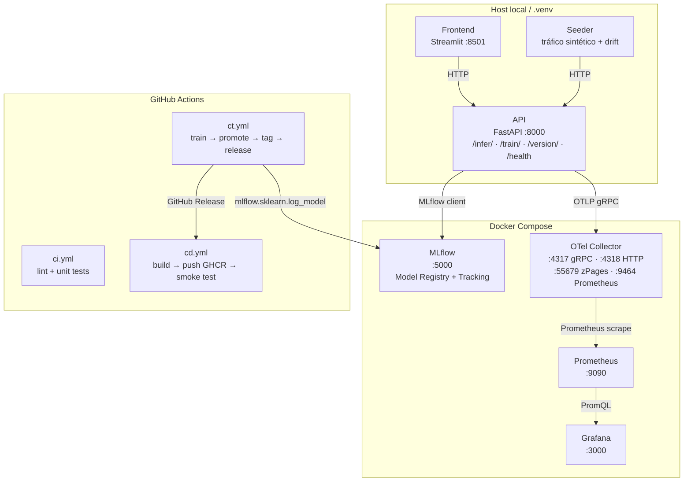
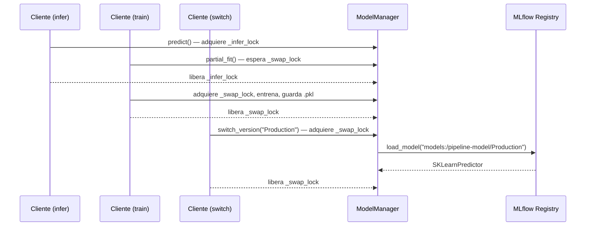

# Arquitectura

## Visión general

PipelineModeling implementa un pipeline de ML continuo siguiendo CRISP-DM. La ejecución es híbrida: API, frontend y seeder corren en el host; MLflow, OTel Collector, Prometheus y Grafana viven en Docker Compose. La observabilidad sigue el patrón OTLP Push → Collector → Prometheus Pull → Grafana, y el versionado de artefactos se gestiona mediante MLflow Model Registry.



---

## Servicios

| Servicio | Puerto | Runtime | Función |
|---|---|---|---|
| **API** | 8000 | `.venv` / Docker | FastAPI: inferencia, entrenamiento incremental, versionado |
| **Frontend** | 8501 | `.venv` / Docker | Streamlit: panel declarativo, 4 tabs |
| **Seeder** | — | `.venv` / Docker | Generador de tráfico sintético y drift simulado |
| **MLflow** | 5000 | Docker | Model Registry (SQLite backend) + tracking server |
| **OTel Collector** | 4317 / 4318 / 55679 / 9464 | Docker | OTLP ingest, resource mapping, exportador Prometheus |
| **Prometheus** | 9090 | Docker | Scrape de métricas y almacenamiento TSDB |
| **Grafana** | 3000 | Docker | Dashboards y datasource provisionados por volumen |

---

## Estructura de directorios

```
PipelineModeling/
├── manage.py                     # CLI unificado (setup · start · stop · status · test · simulate)
├── docker-compose.yml            # Stack Docker completo
├── .env.example
├── model/
│   ├── trainer.py                # ModelTrainer: encapsula train + MLflow log + alias Staging
│   ├── promote.py                # ModelPromoter: valida umbrales y asigna alias Production
│   ├── train.py                  # Entry point: orquesta ModelTrainer + ModelPromoter
│   ├── requirements.txt
│   ├── metrics.json              # Artefacto local (accuracy, f1, precision, recall, roc_auc)
│   └── weights/model.pkl         # SGDClassifier local (.gitignore); copia canónica en MLflow
├── services/
│   ├── api/
│   │   ├── main.py               # App FastAPI + lifespan + FastAPIInstrumentor
│   │   ├── core/
│   │   │   ├── config.py         # Pydantic Settings (MODEL_PATH, MLFLOW_*)
│   │   │   ├── predictor.py      # BasePredictor (ABC) + SKLearnPredictor
│   │   │   ├── drift.py          # DriftTracker singleton (EMA, 30 features)
│   │   │   ├── metrics.py        # PipelineMetrics facade sobre OTel SDK
│   │   │   └── model_manager.py  # Singleton; asyncio locks; hot-swap desde MLflow
│   │   ├── routers/
│   │   │   ├── inference.py      # POST /infer/
│   │   │   ├── training.py       # POST /train/
│   │   │   ├── versioning.py     # GET /version/current · POST /version/switch · POST /version/register
│   │   │   └── debug.py          # POST /debug/chaos
│   │   └── schemas/
│   │       ├── inference.py
│   │       ├── training.py
│   │       └── versioning.py
│   ├── frontend/
│   │   ├── app.py                # Punto de entrada Streamlit
│   │   ├── runtime.py            # UI declarativa (4 tabs)
│   │   ├── controller.py         # Orquestación de negocio
│   │   ├── network.py            # Límite de red (async/sync bridge)
│   │   └── domain.py             # Estado inmutable
│   ├── seeder/seeder.py          # 3 corutinas async: infer, train, drift
│   └── wrapper/client.py         # PipelineClient (async context manager)
├── monitoring/
│   ├── otel-collector/otel-collector.yml
│   ├── prometheus/prometheus.yml
│   └── grafana/
│       ├── provisioning/datasources/datasource.yml
│       ├── provisioning/dashboards/dashboards.yml
│       └── dashboards/pipeline-overview.json
├── .github/workflows/
│   ├── ci.yml                    # Lint (ruff) + tests unitarios
│   ├── ct.yml                    # Entrenamiento continuo + promote + release
│   └── cd.yml                    # Build imagen Docker + push GHCR + smoke test
├── tests/
│   ├── conftest.py
│   ├── test_health.py
│   ├── test_inference.py
│   ├── test_training.py
│   ├── test_versioning.py
│   ├── test_metrics.py
│   ├── test_flow.py
│   ├── test_observability_stack.py
│   └── test_otel_mlflow_migration.py
└── docs/
```

---

## Componentes clave de la API

### BasePredictor — abstracción del modelo

`services/api/core/predictor.py` define el contrato que cualquier implementación de modelo debe satisfacer:

```python
class BasePredictor(ABC):
    def predict(self, X)        -> tuple[int, list[float]]
    def partial_fit(self, X, y) -> None
    def save(self, path)        -> None
    def load(cls, path)         -> BasePredictor
    def create_default(cls)     -> BasePredictor
```

`SKLearnPredictor` envuelve un `SGDClassifier`. Open/Closed: añadir XGBoost u ONNX sin modificar routers.

### ModelManager (singleton)

Gestiona el ciclo de vida del modelo con dos locks asyncio:

- `_infer_lock` — protege lecturas concurrentes (inferencia)
- `_swap_lock` — serializa escrituras (entrenamiento + hot-swap)



### PipelineMetrics (facade OTel)

`services/api/core/metrics.py` es el único punto de emisión de telemetría. Todos los routers y `DriftTracker` llaman métodos tipados de `pipeline_metrics`; ninguno importa OTel SDK directamente. En ausencia de `OTEL_EXPORTER_OTLP_ENDPOINT`, el `MeterProvider` es no-op.

```python
pipeline_metrics.record_inference(status="ok", latency_s=0.012)
pipeline_metrics.record_training(status="ok", n_samples=50)
pipeline_metrics.set_drift_score("radius_mean", 0.63)
pipeline_metrics.record_version_switch(status="ok", duration_s=1.4)
```

### DriftTracker (singleton)

`services/api/core/drift.py` mantiene la media EMA (α = 0.05) por feature y emite scores via `pipeline_metrics.set_drift_score()`:

| Origen | Método | Cuándo emite |
|---|---|---|
| `POST /train/` | `update_batch(features)` | Inmediatamente tras cada batch |
| `POST /infer/` | `update_single(feature_vec)` | Cada 50 peticiones de inferencia |

**Fórmula EMA:**
```
score_i  = |batch_mean_i - ref_mean_i| / (|ref_mean_i| + ε)
ref_mean = 0.95 · ref_mean + 0.05 · batch_mean
```

---

## Modos de despliegue

| Modo | API / Frontend / Seeder | MLflow / OTel | Cuándo usarlo |
|---|---|---|---|
| **Local** (`python manage.py start`) | `.venv` | Docker | Desarrollo, iteración rápida |
| **Docker Compose** (`docker compose up`) | Contenedores | Docker | Integración, demo |
| **CI/CD** (GitHub Actions) | — | MLflow remoto | Reentrenamiento automático + despliegue |

---

## Sincronización MLflow ↔ Docker en producción

El alias `Production` del Model Registry es el contrato entre `ct.yml` y `cd.yml`:

1. `ct.yml` → `ModelTrainer` registra versión, asigna alias `Staging`
2. `ModelPromoter` evalúa métricas → asigna alias `Production` si superan umbrales
3. Sólo si `promoted=true` → `ct.yml` crea tag semver + GitHub Release
4. Release dispara `cd.yml` → imagen Docker con SHA inmutable publicada en GHCR
5. Contenedor arranca con `models://pipeline-model/Production` vía MLflow
6. Rollback: reasignar alias `Production` + `POST /version/switch` sin reconstruir imagen
