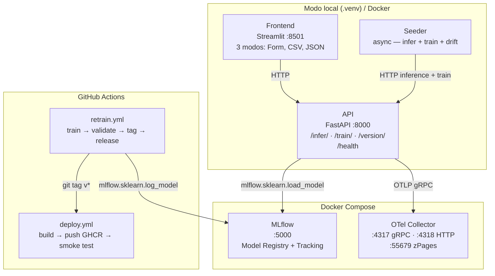
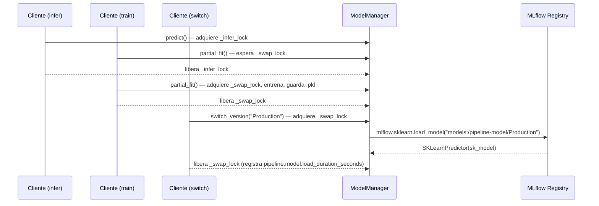
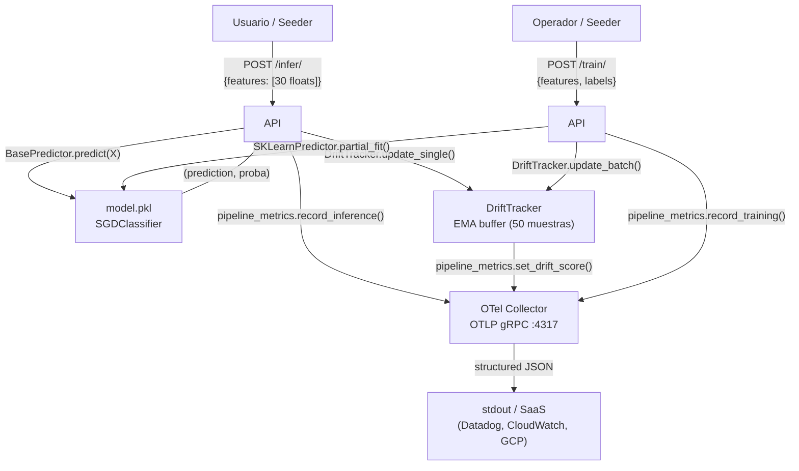

# Arquitectura

## Visión general

PipelineModeling implementa un pipeline de ML continuo con seis componentes siguiendo la metodología CRISP-DM. La observabilidad es vendor-neutral (OpenTelemetry) y el versionado de artefactos se gestiona mediante MLflow Model Registry.



---

## Servicios

| Servicio | Puerto | Runtime | Descripción |
|---|---|---|---|
| **API** | 8000 | `.venv` / Docker | FastAPI: inferencia, entrenamiento incremental, versionado |
| **Frontend** | 8501 | `.venv` / Docker | Streamlit: Form / CSV upload / JSON upload |
| **Seeder** | — | `.venv` / Docker | Generador de tráfico sintético y drift simulado |
| **MLflow** | 5000 | Docker | Model Registry (SQLite backend) + servidor de tracking |
| **OTel Collector** | 4317 / 4318 / 55679 | Docker | Fan-out de telemetría: OTLP in → SaaS exporters out |

---

## Estructura de directorios

```
PipelineModeling/
├── pipeline.ps1                  # CLI unificado (setup/start/stop/status/test/train)
├── docker-compose.yml            # Stack: MLflow + OTel Collector + API + Frontend + Seeder
├── .env.example                  # Plantilla de variables de entorno
├── model/
│   ├── train.py                  # Entrenamiento bootstrap (breast_cancer, SGDClassifier + MLflow)
│   ├── requirements.txt          # scikit-learn, joblib, mlflow
│   ├── metrics.json              # accuracy, f1, precision, recall (artefacto GitHub Release)
│   ├── plots/confusion_matrix.csv
│   └── weights/model.pkl         # Artefacto local (.gitignore); copia canónica en MLflow
├── services/
│   ├── api/
│   │   ├── main.py               # App FastAPI + lifespan + FastAPIInstrumentor
│   │   ├── core/
│   │   │   ├── config.py         # Pydantic Settings (MODEL_PATH, MLFLOW_*)
│   │   │   ├── predictor.py      # BasePredictor (ABC) + SKLearnPredictor
│   │   │   ├── drift.py          # DriftTracker singleton (EMA, 30 features)
│   │   │   ├── metrics.py        # PipelineMetrics facade sobre OTel SDK
│   │   │   └── model_manager.py  # Singleton; asyncio locks; hot-swap MLflow
│   │   ├── routers/
│   │   │   ├── inference.py      # POST /infer/ + DriftTracker.update_single()
│   │   │   ├── training.py       # POST /train/ + DriftTracker.update_batch()
│   │   │   └── versioning.py     # GET/POST /version/ + pipeline_metrics
│   │   └── schemas/
│   │       ├── inference.py      # InferenceRequest / InferenceResponse
│   │       ├── training.py       # TrainingRequest / TrainingResponse
│   │       └── versioning.py     # VersionSwitchRequest (model_ref), VersionCurrentResponse
│   ├── frontend/app.py           # Streamlit (3 tabs: inferencia, entrenamiento, versiones)
│   ├── seeder/seeder.py          # 3 corutinas async: infer, train, drift
│   └── wrapper/client.py         # PipelineClient (async context manager)
├── monitoring/
│   └── otel-collector/
│       └── otel-collector.yml    # OTLP receivers + processors + exporters (Datadog/CW/GCP)
├── .github/
│   └── workflows/
│       ├── retrain.yml           # CI: train → validate → artifact → git tag → GitHub Release
│       └── deploy.yml            # CD: build image → push GHCR → smoke test
└── tests/
    ├── conftest.py               # Fixture httpx.Client + FEATURES_30
    ├── test_health.py
    ├── test_inference.py
    ├── test_training.py
    ├── test_versioning.py
    ├── test_metrics.py           # Valida facade OTel (no Prometheus)
    └── test_flow.py              # Golden path E2E
```

---

## Componentes clave de la API

### BasePredictor — abstracción del modelo

`services/api/core/predictor.py` define el contrato que cualquier implementación de modelo debe satisfacer:

```python
class BasePredictor(ABC):
    def predict(self, X)        -> (int, list[float])  # (clase, probabilidades)
    def partial_fit(self, X, y) -> None                # reentrenamiento incremental
    def save(self, path)        -> None                # persistir a disco
    def load(cls, path)         -> BasePredictor       # cargar desde disco
    def create_default(cls)     -> BasePredictor       # instancia sin entrenar
```

`SKLearnPredictor(BasePredictor)` envuelve un `SGDClassifier`. `ModelManager` y todos los routers dependen solo de `BasePredictor` — Open/Closed permite añadir XGBoost, ONNX, etc. sin modificar la API.

### ModelManager (singleton)

Gestiona el ciclo de vida del modelo con dos locks asyncio:

- `_infer_lock` — protege lecturas concurrentes (inferencia)
- `_swap_lock` — serializa escrituras (entrenamiento + hot-swap de versión)



### PipelineMetrics (facade OTel)

`services/api/core/metrics.py` es el único punto de emisión de telemetría. Todos los routers y `DriftTracker` llaman métodos tipados de `pipeline_metrics`; ninguno importa OTel SDK directamente.

```python
pipeline_metrics.record_inference(status="ok", latency_s=0.012)
pipeline_metrics.record_training(status="ok", n_samples=50)
pipeline_metrics.set_drift_score("radius_mean", 0.63)
pipeline_metrics.record_version_switch(status="ok", duration_s=1.4)
```

En ausencia de `OTEL_EXPORTER_OTLP_ENDPOINT`, el `MeterProvider` es no-op: los tests unitarios funcionan sin infraestructura.

### DriftTracker (singleton compartido)

`services/api/core/drift.py` mantiene la media EMA por feature y emite scores via `pipeline_metrics.set_drift_score()`:

| Origen | Método | Cuándo emite |
|---|---|---|
| `POST /train/` | `update_batch(features)` | Inmediatamente después de cada batch |
| `POST /infer/` | `update_single(feature_vec)` | Después de cada 50 peticiones de inferencia |

**Fórmula EMA (α = 0.05):**
```
score_i  = |batch_mean_i - ref_mean_i| / (|ref_mean_i| + ε)
ref_mean = 0.95 · ref_mean + 0.05 · batch_mean
```

### Hot-swap de versiones (MLflow)

`POST /version/switch` con `{"model_ref": "Production"}` ejecuta en un executor thread:

1. `mlflow.set_tracking_uri(MLFLOW_TRACKING_URI)`
2. `mlflow.sklearn.load_model("models:/pipeline-model/Production")`
3. `SKLearnPredictor(sk_model)` — reemplaza el predictor en memoria
4. Registra `pipeline.model.load_duration_seconds`

Si el pull falla, el modelo en memoria se preserva. El API no reinicia.

---

## Modos de despliegue

| Modo | API / Frontend / Seeder | MLflow / OTel Collector | Cuándo usarlo |
|---|---|---|---|
| **Local** (`pipeline.ps1 start`) | `.venv` con `--reload` | Docker | Desarrollo, iteración rápida |
| **Docker Compose** (`docker compose up`) | Contenedores | Docker | Integración, entrega, demo |
| **CI/CD** (GitHub Actions) | — | MLflow remoto / SaaS | Reentrenamiento automático + despliegue |

---

## Flujo de datos completo


