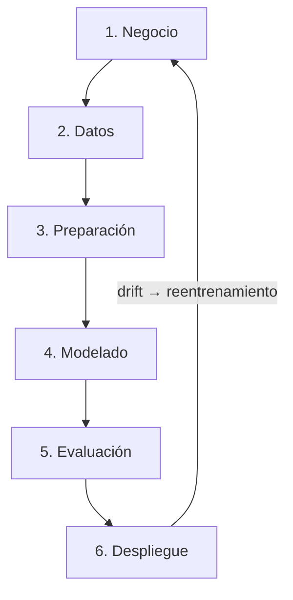

# CRISP-DM — Implementación

| Fase CRISP-DM | Artefacto | Herramientas |
|---|---|---|
| 1. Comprensión del negocio | Criterios: accuracy ≥ 0.80, hot-swap sin 503, drift ≥ 2σ detectado < 2 min | — |
| 2. Comprensión de datos | `docs/dataset.md` | sklearn, numpy |
| 3. Preparación | `model/train.py` (split 80/20 estratificado, sin normalizar) | sklearn |
| 4. Modelado | `services/api/core/predictor.py` (SGDClassifier + BasePredictor), `model/train.py` | SGDClassifier |
| 5. Evaluación | `model/metrics.json`, alertas Prometheus, GitHub Release con métricas | Prometheus, MLflow |
| 6. Despliegue | `docker-compose.yml`, `manage.py`, `POST /version/switch` | Docker, FastAPI, MLflow |

**Ciclo de retroalimentación en producción:**
1. Grafana detecta `pipeline_data_drift_score > 0.5` → alerta `DataDriftDetected`
2. Operador llama `POST /train/` con nuevas muestras o ejecuta `python manage.py simulate --scenario drift`
3. `ModelPromoter` valida umbrales (accuracy ≥ 0.85 · f1 ≥ 0.82 · roc_auc ≥ 0.90)
4. Hot-swap via `POST /version/switch {"model_ref": "Production"}` sin downtime
