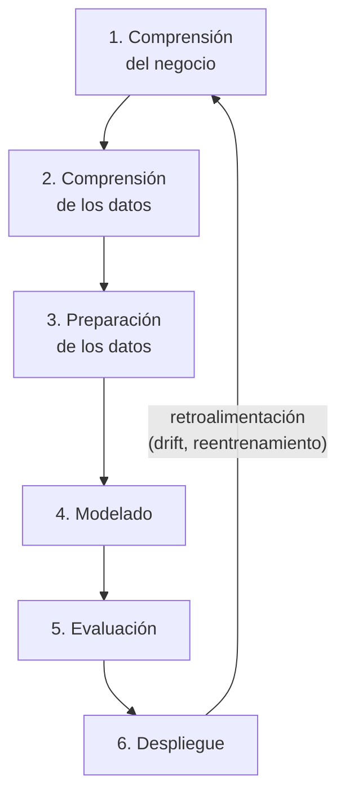
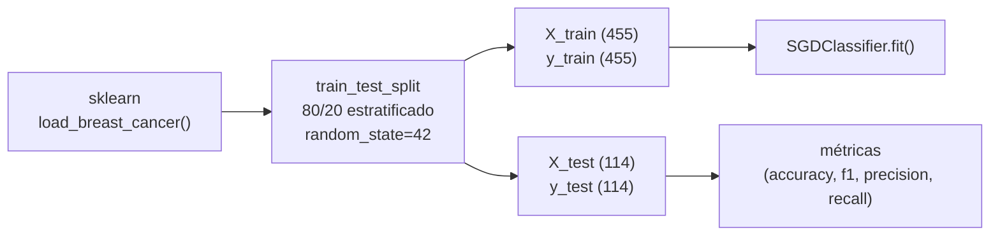

# CRISP-DM aplicado a PipelineModeling

CRISP-DM (Cross-Industry Standard Process for Data Mining) define un proceso iterativo en seis fases para proyectos de minería de datos y aprendizaje automático. Este documento describe cómo cada fase se materializa en PipelineModeling.



---

## Fase 1 — Comprensión del negocio

**Objetivo del proyecto:** demostrar un pipeline de ML continuo que replica un flujo de producción real, incluyendo versionado de modelos, monitorización de drift, reentrenamiento incremental y despliegue sin interrupciones de servicio.

**Objetivos de ML:**

| Objetivo | Implementación |
|---|---|
| Clasificación binaria (maligno/benigno) | SGDClassifier en `model/train.py` |
| Aprendizaje continuo sin reiniciar el servicio | `partial_fit` en `POST /train/` |
| Detección de deriva en distribución de datos | `DriftTracker` (EMA por feature) |
| Trazabilidad de artefactos | DVC + Git tags semánticos |
| Observabilidad de producción | Prometheus + Grafana |

**Criterios de éxito:**
- Accuracy ≥ 0.80 en el split de test inicial.
- El sistema puede cambiar de versión de modelo (`/version/switch`) sin downtime (0 errores 503 en tráfico normal).
- Las métricas de drift detectan un desplazamiento de ≥ 2σ en menos de 2 minutos con el seeder.

---

## Fase 2 — Comprensión de los datos

### Fuente y naturaleza

El dataset **Breast Cancer Wisconsin (Diagnostic)** es un recurso canónico de clasificación binaria médica:

- 569 muestras, 30 features continuas, sin valores faltantes.
- Clases: 0 (maligno, 37.3 %) y 1 (benigno, 62.7 %) — ligero desbalance.
- Escala de features muy heterogénea: `area` ∈ [143, 2501], `fracdim` ∈ [0.05, 0.097].

### Análisis exploratorio

```python
from sklearn.datasets import load_breast_cancer
import numpy as np

data = load_breast_cancer()
X, y = data.data, data.target

# Estadísticas por clase
for cls, name in zip([0, 1], ["maligno", "benigno"]):
    mask = y == cls
    print(f"{name}: n={mask.sum()}, radius_mean={X[mask, 0].mean():.2f}")
# maligno: n=212, radius_mean=17.46
# benigno: n=357, radius_mean=12.15
```

Los tumores malignos tienen radios, áreas y concavidades medias significativamente mayores que los benignos.

### Relevancia para el drift

Las features con mayor poder discriminativo (`radius_mean`, `area_mean`, `concavity_worst`) son también las más sensibles al drift. El seeder desplaza la media de toda la distribución, lo que el `DriftTracker` EMA detecta feature a feature.

---

## Fase 3 — Preparación de los datos

### Pipeline de preparación



| Decisión | Justificación |
|---|---|
| Sin normalización de features | SGDClassifier con log-loss es sensible a la escala; se acepta sin normalizar para mantener `partial_fit` sencillo y sin transformers adicionales |
| Split estratificado | Preserva el ratio de clases (37/63) en ambos conjuntos |
| Sin imputación | El dataset no tiene valores faltantes |
| Sin encoding | Todas las features son continuas |

> **Nota:** en un sistema de producción real se añadiría un `StandardScaler` con `partial_fit` para normalizar el flujo de datos de inferencia. En este proyecto académico se omite para no complicar el hot-swap de versiones.

### Preparación para inferencia online

El seeder genera vectores de 30 features compatibles con el modelo:
- Durante la fase normal: valores del dataset con ruido `N(0, σ_feature * 0.1)`.
- Durante la fase de drift: desplazamiento `+ DRIFT_MAGNITUDE * σ_feature`.

---

## Fase 4 — Modelado

### Selección del algoritmo

**SGDClassifier (log-loss)** fue elegido por tres razones técnicas:

1. `partial_fit(X, y, classes=[0,1])` — soporta aprendizaje incremental nativo.
2. `predict_proba` disponible con `loss="log_loss"` — necesario para el frontend y las métricas.
3. Bajo coste computacional — permite reentrenamiento en tiempo real sin impacto perceptible en latencia de inferencia.

### Abstracción `BasePredictor`

El principio Open/Closed se aplica a través de una jerarquía de clases:

```
BasePredictor (ABC)
└── SKLearnPredictor          ← implementación actual
    (SGDClassifier wrapeado)

# Para añadir un nuevo tipo de modelo:
class XGBoostPredictor(BasePredictor): ...   ← solo esto cambia
```

`ModelManager` depende únicamente de `BasePredictor`; los routers no conocen la implementación concreta.

### Parámetros rastreados por DVC

```python
# model/train.py — rastreados en dvc.yaml params
DATASET      = "breast_cancer"   # fuente de datos
N_FEATURES   = 30                # dimensionalidad (fijada por el dataset)
RANDOM_STATE = 42                # controla reproducibilidad del split y SGD
```

Cambiar `RANDOM_STATE` produce un modelo diferente y fuerza a DVC a re-ejecutar el pipeline.

### Reentrenamiento incremental

```
POST /train/
  body: { "features": [[...30...], ...], "labels": [0, 1, ...] }
  
→ SKLearnPredictor.partial_fit(X, y, classes=[0,1])
→ modelo se actualiza en memoria
→ model.pkl se persiste en disco
→ DriftTracker.update_batch(features)  ← actualiza EMA de referencia
```

---

## Fase 5 — Evaluación

### Métricas del modelo

Las métricas se calculan en el split de test y se guardan en `model/metrics.json`:

| Métrica | Valor | Interpretación |
|---|---|---|
| **Accuracy** | 0.833 | El 83.3 % de los diagnósticos son correctos |
| **F1-score** | 0.857 | Balance entre precisión y recall para la clase benigna |
| **Precision** | 0.934 | El 93.4 % de los "benignos" predichos son realmente benignos |
| **Recall** | 0.792 | Se detecta el 79.2 % de todos los benignos reales |

> El recall de malignos (clase 0) no se reporta directamente pero se puede inferir: con 212 malignos y accuracy 83.3 %, el modelo acierta ≈175/212 malignos.

### Evaluación continua en producción

Más allá del split estático, el sistema implementa evaluación continua mediante:

| Señal | Métrica Prometheus | Umbral de alerta |
|---|---|---|
| Tasa de errores de inferencia | `pipeline_inference_requests_total{status="error"}` | > 5 % durante 5 min |
| Latencia p99 | `pipeline_inference_latency_seconds` | > 500 ms durante 3 min |
| Drift de features | `pipeline_data_drift_score{feature="..."}` | > 0.5 durante 5 min |
| Modelo descargado | `pipeline_model_loaded` | == 0 durante 1 min |

### Comparación de versiones

```powershell
# Comparar métricas entre versiones DVC
.venv\Scripts\dvc metrics diff v1.0.0 v2.0.0

# Ver métricas de la versión actual
.venv\Scripts\dvc metrics show
```

---

## Fase 6 — Despliegue

### Modos de despliegue

#### Modo local (desarrollo)

```powershell
.\pipeline.ps1 start
```

- API/Frontend/Seeder corren en `.venv` con `uvicorn --reload`.
- MinIO/Prometheus/Grafana corren en Docker.
- Recarga automática de código sin reiniciar el stack.

#### Modo Docker Compose (integración / demo)

```powershell
docker compose up --build    # compilar imágenes y arrancar
docker compose up            # arranques posteriores
```

Todos los servicios en contenedores. Aislamiento completo. Ver [development.md](development.md).

### Versionado de modelos (DVC + Git)

El flujo de despliegue de una nueva versión:

```mermaid
flowchart TD
    A["Cambiar RANDOM_STATE\nen model/train.py"] --> B["pipeline.ps1 train\n-Version v2.1.0 -RandomState 7"]
    B --> C["dvc repro\n→ re-entrena modelo"]
    C --> D["dvc push --remote local/minio\n→ artefacto en dvc-remote/ o MinIO"]
    D --> E["git commit + git tag v2.1.0\n→ metadatos versionados"]
    E --> F["POST /version/switch\n{\"git_ref\": \"v2.1.0\"}"]
    F --> G["git checkout v2.1.0 -- .dvc\ndvc pull --force\njoblib.load(model.pkl)"]
    G --> H["Modelo activo cambiado\nsin reiniciar API"]
```

### Ciclo de retroalimentación

El sistema implementa el ciclo iterativo de CRISP-DM en producción:

1. **Monitorización** — Grafana muestra drift score por feature en tiempo real.
2. **Detección** — Alerta `DataDriftDetected` si alguna feature supera score 0.5.
3. **Reentrenamiento** — El operador llama `POST /train/` con nuevas muestras o ejecuta `pipeline.ps1 train`.
4. **Evaluación** — DVC registra las nuevas métricas en `metrics.json`.
5. **Despliegue** — Hot-swap vía `POST /version/switch` sin downtime.
6. **Vuelta a Fase 1** — Los nuevos datos redefinen la distribución de referencia del `DriftTracker`.

---

## Resumen de implementación CRISP-DM

| Fase CRISP-DM | Artefacto principal | Herramientas |
|---|---|---|
| Comprensión del negocio | Este documento | — |
| Comprensión de los datos | `docs/dataset.md`, `model/train.py` | sklearn, numpy |
| Preparación de los datos | `model/train.py` (split estratificado) | sklearn |
| Modelado | `services/api/core/predictor.py`, `model/train.py` | SGDClassifier, DVC |
| Evaluación | `model/metrics.json`, Grafana, `/metrics` | Prometheus, DVC metrics |
| Despliegue | `docker-compose.yml`, `pipeline.ps1`, `/version/switch` | Docker, FastAPI, DVC |
