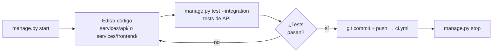

# Desarrollo

## Flujo de trabajo habitual



```bash
python manage.py start      # levanta stack Docker + runner GH Actions (Windows)
# ... edita código en services/api/ o services/frontend/
python manage.py test --integration   # verifica que nada se rompió
python manage.py stop       # para todo al terminar
```

---

## CLI de gestión

```
python manage.py <comando> [opciones]

  setup            Primera configuración (venv, deps, .env, modelo inicial)
  start            Arranca stack Docker + runner GH Actions en Windows
  stop             Para todos los servicios + termina el runner
  status           Estado de contenedores Docker
  test             Suite completa de pytest
  test --unit      Solo tests sin API (linting y unitarios)
  test --integration  Integración (requiere stack activo)
  test --frontend  E2E Playwright (requiere stack activo y playwright install chromium)
  simulate         Escenarios de carga y alertas
```

Ver [cicd.md](cicd.md) para el ciclo CI/CT/CD.

---

## Modo local vs Docker Compose

| Aspecto | `pipeline.ps1 start` | `docker compose up` |
|---|---|---|
| API / Frontend / Seeder | `.venv` con `--reload` | Contenedores (requiere `--build` si cambia código) |
| MLflow / OTel Collector / Prometheus / Grafana | Docker | Docker |
| Recarga automática | Sí (uvicorn `--reload`) | No |
| Ideal para | Desarrollo iterativo | Demo, integración, entrega |

### Docker Compose completo

```powershell
docker compose up --build    # primer arranque o tras cambiar código
docker compose up            # arranques posteriores
docker compose down          # parar (preserva volúmenes)
docker compose down -v       # parar y borrar volúmenes (reset completo)
```

El stack completo incluye: MLflow + OTel Collector + Prometheus + Grafana + API + Seeder + Frontend.

---

## Iterar sobre la API

Con `pipeline.ps1 start` activo, uvicorn corre con `--reload`. Cualquier cambio en `services/api/` se aplica sin reiniciar el resto del stack.

Para añadir soporte a un nuevo tipo de modelo, basta con implementar `BasePredictor`:

```python
# services/api/core/predictor.py
class XGBoostPredictor(BasePredictor):
    def predict(self, X): ...
    def partial_fit(self, X, y): ...
    def save(self, path): ...
    @classmethod
    def load(cls, path): ...
    @classmethod
    def create_default(cls): ...
```

Y cambiar la línea en `model_manager.py`:
```python
# Antes
self._predictor = SKLearnPredictor.load(path)
# Después
self._predictor = XGBoostPredictor.load(path)
```

---

## Añadir un endpoint nuevo

1. Crea o edita un router en `services/api/routers/`
2. Define los schemas en `services/api/schemas/`
3. Registra el router en `services/api/main.py`
4. Añade tests en `tests/test_<nombre>.py`
5. Si el endpoint emite métricas nuevas, defínelas en `services/api/core/metrics.py`

---

## Añadir métricas Prometheus

En `services/api/core/metrics.py`:

```python
from prometheus_client import Counter

MY_COUNTER = Counter(
    "pipeline_my_event_total",
    "Descripción del contador",
    ["label_name"],
)
```

En el router correspondiente:

```python
from core.metrics import MY_COUNTER

MY_COUNTER.labels(label_name="value").inc()
```

---

## Reconstruir un servicio Docker específico

```powershell
docker compose up --build api --no-deps
docker compose up --build frontend --no-deps
```

---

## Ver logs en modo Docker Compose

```powershell
docker compose logs -f api seeder   # API y seeder
docker compose logs -f              # todos los servicios
docker compose logs -f --tail=100 api  # últimas 100 líneas de la API
```

---

## Limpiar el entorno

```powershell
python manage.py stop
docker compose down -v          # elimina volúmenes (MLflow, Prometheus, Grafana)
Remove-Item -Recurse .venv      # borrar entorno virtual
```

---

## Desarrollo del frontend

El frontend vive en `services/frontend/` con cuatro módulos:

| Módulo | Responsabilidad |
|--------|----------------|
| `domain.py` | Dataclasses inmutables (`AppState`, `VersionInfo`, `InferenceRecord`, …) y funciones puras de transformación |
| `network.py` | Wrappers sincrónicos que ejecutan `asyncio.run` en thread pool sobre los métodos del `PipelineClient` |
| `controller.py` | Orquesta llamadas de red y actualiza el `AppState` — sin Streamlit |
| `runtime.py` | Renderizado Streamlit (`_tab_inference`, `_tab_training`, `_tab_versioning`, `_tab_debug`, sidebar) |

Para añadir un endpoint nuevo al frontend:

1. Agregar el método async en `services/wrapper/client.py`.
2. Agregar el coroutine `_xxx` y el wrapper `fetch_xxx` en `network.py`.
3. Agregar el controlador en `controller.py` que actualiza `AppState`.
4. Añadir el campo necesario en `domain.py` si el estado nuevo persiste entre renders.
5. Llamar el controlador desde el tab correspondiente en `runtime.py`.

Para modificar el diseño visual, editar únicamente `_inject_styles()` en `runtime.py` y los bloques `st.*` dentro de cada función `_tab_*`.

---

## Tests E2E del frontend con Playwright

### Prerequisitos

```bash
# Una vez, después de manage.py setup
playwright install chromium
```

### Ejecución

```bash
# Con stack activo
python manage.py test --frontend

# Directamente con pytest
pytest tests/test_frontend.py -v

# Solo tests estables (excluye fragile)
pytest tests/test_frontend.py -v -m "not fragile"
```

### Marcador `fragile`

Los tests FE-04 y FE-07 están marcados con `@pytest.mark.fragile` porque dependen de la estructura interna del DOM de Streamlit (selectores `input[type="number"]`, botones por texto literal). Pueden romper tras actualizar `streamlit` en `services/frontend/requirements.txt`. Al actualizarlo, ejecutar `pytest tests/test_frontend.py -m fragile` y ajustar los selectores si fallan.

### Variable de entorno

`FRONTEND_URL` controla la URL base (default `http://localhost:8501`). Útil en CI si el frontend corre en otro puerto:

```bash
FRONTEND_URL=http://localhost:8502 pytest tests/test_frontend.py -v
```

---

## Problemas frecuentes

**API no disponible al ejecutar tests:**
```bash
python manage.py start   # asegura que el stack está activo
python manage.py test --integration
```

**Playwright no encuentra el navegador:**
```bash
playwright install chromium
```

**Runner UAC rechazado o no arranca:**
Ejecutar manualmente como Administrador:
```powershell
Set-Location C:\actions-runner
.\run.cmd
```

**Verificar si el puerto 8000 está ocupado:**
```powershell
Get-NetTCPConnection -LocalPort 8000 | ForEach-Object {
    Get-Process -Id $_.OwningProcess -ErrorAction SilentlyContinue
}
```

**`pipeline.ps1 train` falla: "DVC uso cache"**  
Pasa `-RandomState` con un valor diferente al que hay en `model/train.py`. El dataset es fijo (breast_cancer), por lo que el único parámetro variable es `RANDOM_STATE`.

**`/version/switch` devuelve 500**  
El ref debe existir localmente. Ejecuta `git fetch` antes si el tag viene del remoto.

**`dvc pull` falla: "file not found in remote"**  
El artefacto no está en el remote. Ejecuta `dvc repro && dvc push --remote local`.

**MinIO no arranca**  
Verifica que el puerto 9000 no esté ocupado y que Docker Desktop esté corriendo:
```powershell
docker compose logs minio
```

**Grafana muestra "No data" en paneles de version switch**  
Los paneles "Version Switches" y "Model Load Duration" necesitan al menos una llamada a `POST /version/switch` para mostrar datos. Ejecuta un switch manual desde el frontend o con:
```powershell
Invoke-RestMethod -Method Post http://localhost:8000/version/switch `
    -ContentType "application/json" -Body '{"git_ref": "HEAD"}'
```

**Frontend no puede conectar con la API**  
Verifica que `API_URL=http://localhost:8000` esté en el entorno del proceso Streamlit. En modo Docker, la URL debe ser `http://api:8000`.

**`docker compose build` falla: "Unable to locate package git/curl"**  
La caché de Docker tiene una capa de `apt-get update` obsoleta. Fuerza una reconstrucción limpia:
```powershell
docker compose build --no-cache api
```
