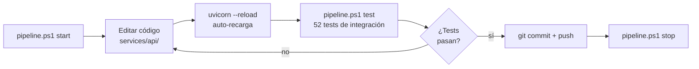

# Desarrollo

## Flujo de trabajo habitual



```powershell
.\pipeline.ps1 start    # arranca todo
# ... edita código en services/api/ — uvicorn recarga automáticamente
.\pipeline.ps1 test     # verifica que nada se rompió
.\pipeline.ps1 stop     # para todo al terminar
```

---

## CLI de gestión

```
.\pipeline.ps1 <comando> [opciones]

  setup    Primera configuración (venv, deps, .env, modelo inicial)
  start    Arranca API + Frontend + Seeder + Prometheus + Grafana
  stop     Para todos los servicios
  status   Estado de servicios y versión activa del modelo
  test     Ejecuta la suite de integración (requiere API activa)
  train    Entrena y versiona un nuevo modelo con DVC + Git
```

Ver [versioning.md](versioning.md) para los parámetros del comando `train`.

---

## Modo local vs Docker Compose

| Aspecto | `pipeline.ps1 start` | `docker compose up` |
|---|---|---|
| API / Frontend / Seeder | `.venv` con `--reload` | Contenedores (requiere `--build` si cambia código) |
| Prometheus / Grafana | Docker | Docker |
| Recarga automática | Sí (uvicorn `--reload`) | No |
| Ideal para | Desarrollo iterativo | Demo, integración, entrega |

### Docker Compose completo

```powershell
docker compose up --build    # primer arranque o tras cambiar código
docker compose up            # arranques posteriores
docker compose down          # parar (preserva volúmenes)
docker compose down -v       # parar y borrar volúmenes
```

---

## Iterar sobre la API

Con `pipeline.ps1 start` activo, uvicorn corre con `--reload`. Cualquier cambio en `services/api/` se aplica sin reiniciar el resto del stack.

Los logs de la API son visibles en la ventana de terminal "PipelineModeling - API".

---

## Añadir un endpoint nuevo

1. Crea o edita un router en `services/api/routers/`
2. Define los schemas en `services/api/schemas/`
3. Registra el router en `services/api/main.py`
4. Añade tests en `tests/test_<nombre>.py`
5. Si el endpoint emite métricas nuevas, defínelas en `services/api/core/metrics.py`

---

## Añadir métricas Prometheus

En `services/api/core/metrics.py`:

```python
from prometheus_client import Counter

MY_COUNTER = Counter(
    "pipeline_my_event_total",
    "Descripción del contador",
    ["label_name"],
)
```

En el router correspondiente:

```python
from core.metrics import MY_COUNTER

MY_COUNTER.labels(label_name="value").inc()
```

---

## Reconstruir un servicio Docker específico

```powershell
docker compose up --build api --no-deps
```

---

## Ver logs en modo Docker Compose

```powershell
docker compose logs -f api seeder   # API y seeder
docker compose logs -f              # todos los servicios
```

---

## Limpiar el entorno

```powershell
.\pipeline.ps1 stop
docker compose down -v          # elimina volúmenes de Prometheus y Grafana
Remove-Item -Recurse .venv      # borrar entorno virtual
```

---

## Problemas frecuentes

**`.\pipeline.ps1` bloqueado por PowerShell**
```powershell
Set-ExecutionPolicy -Scope CurrentUser RemoteSigned
```

**`pipeline.ps1 start` falla: "API did not become healthy within 60s"**  
Abre la ventana "PipelineModeling - API" para ver el error. Causas frecuentes: puerto 8000 ocupado, import error en el código, o modelo corrupto.

**`pipeline.ps1 train` falla: "DVC uso cache"**  
Pasa `-NSamples` o `-RandomState` con un valor diferente al que hay en `model/train.py` en ese momento.

**`/version/switch` devuelve 500**  
El ref debe existir localmente. Ejecuta `git fetch` antes si el tag viene del remoto.

**`dvc pull` falla: "file not found in remote"**  
El artefacto no está en `dvc-remote/`. Ejecuta `dvc repro && dvc push --remote local`.

**Grafana muestra "No data"**  
Espera 15–20 s tras el arranque para el primer scrape. Verifica http://localhost:9090/targets → `pipeline_api` debe estar **UP**.
