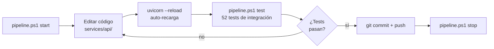

# Desarrollo

## Flujo de trabajo habitual



```powershell
.\pipeline.ps1 start    # arranca todo (API + Frontend + Seeder + MinIO + Prometheus + Grafana)
# ... edita código en services/api/ — uvicorn recarga automáticamente
.\pipeline.ps1 test     # verifica que nada se rompió
.\pipeline.ps1 stop     # para todo al terminar
```

---

## CLI de gestión

```
.\pipeline.ps1 <comando> [opciones]

  setup    Primera configuración (venv, deps, .env, modelo inicial)
  start    Arranca API + Frontend + Seeder + MinIO + Prometheus + Grafana
  stop     Para todos los servicios
  status   Estado de servicios y versión activa del modelo
  test     Ejecuta la suite de integración (requiere API activa)
  train    Entrena y versiona un nuevo modelo con DVC + Git
```

Opciones de `train`:
```
  -Version <vX.Y.Z>          Tag semántico (obligatorio)
  -RandomState <int>          Nuevo valor de RANDOM_STATE en train.py
  -Remote <local|minio>       Remote DVC destino (default: local)
```

Ver [versioning.md](versioning.md) para el flujo completo.

---

## Modo local vs Docker Compose

| Aspecto | `pipeline.ps1 start` | `docker compose up` |
|---|---|---|
| API / Frontend / Seeder | `.venv` con `--reload` | Contenedores (requiere `--build` si cambia código) |
| MinIO / Prometheus / Grafana | Docker | Docker |
| Recarga automática | Sí (uvicorn `--reload`) | No |
| Ideal para | Desarrollo iterativo | Demo, integración, entrega |

### Docker Compose completo

```powershell
docker compose up --build    # primer arranque o tras cambiar código
docker compose up            # arranques posteriores
docker compose down          # parar (preserva volúmenes)
docker compose down -v       # parar y borrar volúmenes (reset completo)
```

El stack completo incluye: MinIO + minio-init + API + Seeder + Frontend + Prometheus + Grafana.

---

## Iterar sobre la API

Con `pipeline.ps1 start` activo, uvicorn corre con `--reload`. Cualquier cambio en `services/api/` se aplica sin reiniciar el resto del stack.

Para añadir soporte a un nuevo tipo de modelo, basta con implementar `BasePredictor`:

```python
# services/api/core/predictor.py
class XGBoostPredictor(BasePredictor):
    def predict(self, X): ...
    def partial_fit(self, X, y): ...
    def save(self, path): ...
    @classmethod
    def load(cls, path): ...
    @classmethod
    def create_default(cls): ...
```

Y cambiar la línea en `model_manager.py`:
```python
# Antes
self._predictor = SKLearnPredictor.load(path)
# Después
self._predictor = XGBoostPredictor.load(path)
```

---

## Añadir un endpoint nuevo

1. Crea o edita un router en `services/api/routers/`
2. Define los schemas en `services/api/schemas/`
3. Registra el router en `services/api/main.py`
4. Añade tests en `tests/test_<nombre>.py`
5. Si el endpoint emite métricas nuevas, defínelas en `services/api/core/metrics.py`

---

## Añadir métricas Prometheus

En `services/api/core/metrics.py`:

```python
from prometheus_client import Counter

MY_COUNTER = Counter(
    "pipeline_my_event_total",
    "Descripción del contador",
    ["label_name"],
)
```

En el router correspondiente:

```python
from core.metrics import MY_COUNTER

MY_COUNTER.labels(label_name="value").inc()
```

---

## Reconstruir un servicio Docker específico

```powershell
docker compose up --build api --no-deps
docker compose up --build frontend --no-deps
```

---

## Ver logs en modo Docker Compose

```powershell
docker compose logs -f api seeder   # API y seeder
docker compose logs -f              # todos los servicios
docker compose logs -f --tail=100 api  # últimas 100 líneas de la API
```

---

## Limpiar el entorno

```powershell
.\pipeline.ps1 stop
docker compose down -v          # elimina volúmenes (Prometheus, Grafana, MinIO)
Remove-Item -Recurse .venv      # borrar entorno virtual
Remove-Item dvc-remote -Recurse -ErrorAction SilentlyContinue  # borrar artefactos DVC locales
```

---

## Problemas frecuentes

**`.\pipeline.ps1` bloqueado por PowerShell**
```powershell
Set-ExecutionPolicy -Scope CurrentUser RemoteSigned
```

**`pipeline.ps1 start` falla: "API did not become healthy within 60s"**  
Abre la ventana "PipelineModeling - API" para ver el error. Causas frecuentes: puerto 8000 ya ocupado por otra instancia, import error en el código, o modelo corrupto.

**Verificar si el puerto 8000 está ocupado:**
```powershell
Get-NetTCPConnection -LocalPort 8000 | ForEach-Object {
    Get-Process -Id $_.OwningProcess -ErrorAction SilentlyContinue
}
```

**`pipeline.ps1 train` falla: "DVC uso cache"**  
Pasa `-RandomState` con un valor diferente al que hay en `model/train.py`. El dataset es fijo (breast_cancer), por lo que el único parámetro variable es `RANDOM_STATE`.

**`/version/switch` devuelve 500**  
El ref debe existir localmente. Ejecuta `git fetch` antes si el tag viene del remoto.

**`dvc pull` falla: "file not found in remote"**  
El artefacto no está en el remote. Ejecuta `dvc repro && dvc push --remote local`.

**MinIO no arranca**  
Verifica que el puerto 9000 no esté ocupado y que Docker Desktop esté corriendo:
```powershell
docker compose logs minio
```

**Grafana muestra "No data" en paneles de version switch**  
Los paneles "Version Switches" y "Model Load Duration" necesitan al menos una llamada a `POST /version/switch` para mostrar datos. Ejecuta un switch manual desde el frontend o con:
```powershell
Invoke-RestMethod -Method Post http://localhost:8000/version/switch `
    -ContentType "application/json" -Body '{"git_ref": "HEAD"}'
```

**Frontend no puede conectar con la API**  
Verifica que `API_URL=http://localhost:8000` esté en el entorno del proceso Streamlit. En modo Docker, la URL debe ser `http://api:8000`.

**`docker compose build` falla: "Unable to locate package git/curl"**  
La caché de Docker tiene una capa de `apt-get update` obsoleta. Fuerza una reconstrucción limpia:
```powershell
docker compose build --no-cache api
```
