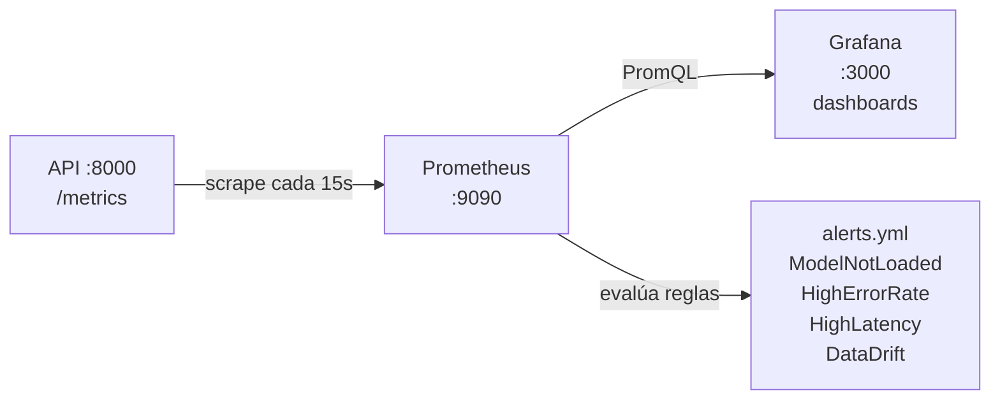

# Monitorización

## Flujo de métricas



## Acceso

| URL | Servicio |
|---|---|
| http://localhost:9090 | Prometheus — explorador de métricas y alertas |
| http://localhost:3000 | Grafana — dashboards (usuario: `admin`, contraseña: ver `.env`) |

---

## Métricas Prometheus

Todas las métricas tienen el prefijo `pipeline_`.

| Métrica | Tipo | Etiquetas | Descripción |
|---|---|---|---|
| `pipeline_model_loaded` | Gauge | — | `1` cuando el modelo está cargado, `0` durante hot-swap o fallo |
| `pipeline_inference_requests_total` | Counter | `status={ok,error}` | Total de peticiones de inferencia |
| `pipeline_inference_latency_seconds` | Histogram | — | Latencia end-to-end del endpoint `/infer/` |
| `pipeline_training_requests_total` | Counter | `status={ok,error}` | Total de peticiones de entrenamiento |
| `pipeline_training_samples_total` | Counter | — | Total de muestras procesadas con `partial_fit` |
| `pipeline_data_drift_score` | Gauge | `feature={f0..f9}` | Score de drift por feature (EMA, rango 0–∞) |
| `pipeline_version_switches_total` | Counter | `status={ok,error}` | Total de cambios de versión |

### Consultas útiles en Prometheus

```promql
# Tasa de inferencias por segundo (últimos 5 min)
rate(pipeline_inference_requests_total{status="ok"}[5m])

# Tasa de errores (últimos 5 min)
rate(pipeline_inference_requests_total{status="error"}[5m])

# Latencia p99 de inferencia
histogram_quantile(0.99, rate(pipeline_inference_latency_seconds_bucket[5m]))

# Muestras de entrenamiento acumuladas
pipeline_training_samples_total

# Features con drift alto (> 0.5)
pipeline_data_drift_score > 0.5
```

---

## Dashboard Grafana

El dashboard **PipelineModeling** se provisiona automáticamente al arrancar.  
Incluye los siguientes paneles:

| Panel | Métrica |
|---|---|
| Inference RPS | `rate(pipeline_inference_requests_total[1m])` |
| Error rate | Porcentaje de `status="error"` sobre el total |
| Latencia p50 / p95 / p99 | `histogram_quantile` sobre `inference_latency_seconds` |
| Training samples (acumulado) | `pipeline_training_samples_total` |
| Model loaded | `pipeline_model_loaded` |
| Drift score por feature | `pipeline_data_drift_score{feature=~"f.*"}` |
| Version switches | `pipeline_version_switches_total` |

> Si los paneles muestran "No data" al arrancar, espera 15–20 s para el primer scrape de Prometheus.  
> Verifica que `http://localhost:9090/targets` muestra `pipeline_api` en estado **UP**.

---

## Alertas

Definidas en `monitoring/prometheus/alerts.yml`:

| Alerta | Condición | Durante | Severidad |
|---|---|---|---|
| `ModelNotLoaded` | `pipeline_model_loaded == 0` | 1 min | critical |
| `HighInferenceErrorRate` | tasa de errores > 5 % | 5 min | warning |
| `HighInferenceLatencyP99` | p99 > 500 ms | 3 min | warning |
| `DataDriftDetected` | `pipeline_data_drift_score > 0.5` | 5 min | warning |

Ver alertas activas en http://localhost:9090/alerts.

---

## Simular drift manualmente

El seeder activa el drift automáticamente a los `DRIFT_ONSET_AFTER_S` segundos (por defecto 120).  
Para forzarlo de inmediato, cierra la ventana del seeder y ábrela con:

```powershell
$env:API_URL             = "http://localhost:8000"
$env:DRIFT_ONSET_AFTER_S = "0"
$env:DRIFT_MAGNITUDE     = "3.0"
.venv\Scripts\python services\seeder\seeder.py
```

En unos segundos, `pipeline_data_drift_score` superará 0.5 y se disparará la alerta.
