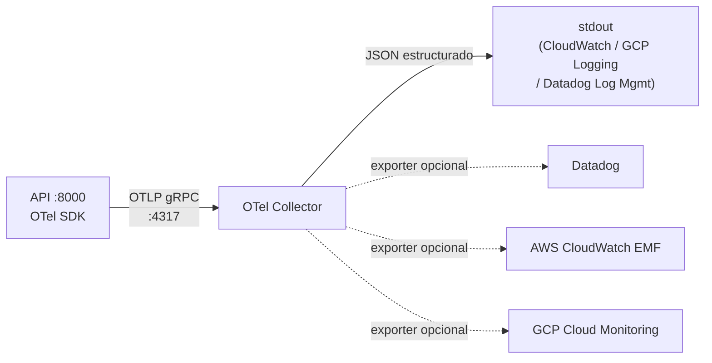

# Monitorización

## Flujo de telemetría



El Collector actúa de fan-out: recibe OTLP y puede exportar a cualquier backend SaaS sin cambiar código Python.

## Acceso local

| URL | Servicio |
|---|---|
| http://localhost:5000 | MLflow — tracking UI + Model Registry |
| http://localhost:55679 | OTel Collector zPages — debug de pipelines y exporters |
| http://localhost:4317 | OTLP gRPC receiver (uso interno) |
| http://localhost:4318 | OTLP HTTP receiver (uso interno) |

---

## Métricas de la API (instrumentos OTel)

Todas las métricas usan el prefijo `pipeline.` con separador de punto (convención OTel).

| Métrica | Tipo | Atributos | Descripción |
|---|---|---|---|
| `pipeline.model.loaded` | ObservableGauge | — | `1` cuando el modelo está cargado, `0` durante hot-swap o fallo |
| `pipeline.inference.requests_total` | Counter | `status={ok,error}` | Total de peticiones de inferencia |
| `pipeline.inference.latency_seconds` | Histogram | `status={ok,error}` | Latencia end-to-end del endpoint `/infer/` |
| `pipeline.training.requests_total` | Counter | `status={ok,error}` | Total de peticiones de entrenamiento |
| `pipeline.training.samples_total` | Counter | — | Total de muestras procesadas con `partial_fit` |
| `pipeline.data.drift_score` | ObservableGauge | `feature={nombre}` | Score de drift por feature (EMA, rango 0–∞) |
| `pipeline.version.switches_total` | Counter | `status={ok,error}` | Total de cambios de versión |
| `pipeline.model.load_duration_seconds` | Histogram | — | Tiempo de carga desde MLflow en cada version switch |

### Atributo `feature` del drift score

Las 30 features del dataset breast cancer se usan como atributo `feature`:

```
radius_mean    texture_mean    perimeter_mean  area_mean
smoothness_mean  compactness_mean  concavity_mean  concpts_mean
symmetry_mean  fracdim_mean
radius_se      texture_se      perimeter_se    area_se
smoothness_se  compactness_se  concavity_se    concpts_se
symmetry_se    fracdim_se
radius_worst   texture_worst   perimeter_worst area_worst
smoothness_worst  compactness_worst  concavity_worst  concpts_worst
symmetry_worst fracdim_worst
```

---

## Trazas distribuidas

`FastAPIInstrumentor` inyecta tramos OTel en cada request HTTP automáticamente. Las trazas incluyen:

- `http.method`, `http.route`, `http.status_code`
- `service.name` = `pipeline-api` (configurable via `OTEL_SERVICE_NAME`)
- `service.version` = `IMAGE_TAG` enriquecido por el resource processor del Collector

---

## Configuración del Collector

El archivo `monitoring/otel-collector/otel-collector.yml` define tres pipelines (metrics, traces, logs) con los mismos receivers y processors:

```yaml
processors:
  resource:
    attributes:
      - key: deployment.environment
        value: ${env:DEPLOY_ENV:-local}
        action: upsert
      - key: service.version
        value: ${env:IMAGE_TAG:-dev}
        action: upsert
```

### Activar exporters SaaS

1. Descomentar el bloque del exporter deseado en `otel-collector.yml`.
2. Añadir su nombre a la lista `exporters` del pipeline correspondiente.
3. Definir las variables de entorno en `.env`:

| Backend | Variable requerida |
|---|---|
| Datadog | `DATADOG_API_KEY`, `DD_SITE` |
| AWS CloudWatch EMF | `AWS_ACCESS_KEY_ID`, `AWS_SECRET_ACCESS_KEY`, `AWS_DEFAULT_REGION` |
| GCP Cloud Monitoring | `GOOGLE_APPLICATION_CREDENTIALS`, `GCP_PROJECT_ID` |

No se necesita modificar código Python en ningún caso.

---

## Alertas

Sin Prometheus/Grafana, las alertas se configuran en el backend SaaS elegido. Equivalencias recomendadas:

| Alerta anterior (Prometheus) | Equivalente SaaS |
|---|---|
| `ModelNotLoaded` | Alerta cuando `pipeline.model.loaded = 0` durante > 1 min |
| `HighInferenceErrorRate` | Tasa de `pipeline.inference.requests_total{status="error"}` > 5 % en 5 min |
| `HighInferenceLatencyP99` | p99 de `pipeline.inference.latency_seconds` > 500 ms en 3 min |
| `DataDriftDetected` | `pipeline.data.drift_score` > 0.5 en cualquier feature durante 5 min |

---

## Cómo se produce el drift en inferencia

El `DriftTracker` singleton recibe actualizaciones de dos orígenes:

| Origen | Método | Cuándo emite |
|---|---|---|
| `POST /train/` | `update_batch(features)` | Inmediatamente después de cada batch |
| `POST /infer/` | `update_single(feature_vec)` | Después de cada 50 peticiones de inferencia |

La actualización EMA (α = 0.05) actualiza la referencia de forma suave. Un desplazamiento brusco como el que genera el seeder (> 2σ) eleva `pipeline.data.drift_score` a valores > 0.5.

---

## Simular drift manualmente

```powershell
$env:API_URL             = "http://localhost:8000"
$env:DRIFT_ONSET_AFTER_S = "0"
$env:DRIFT_MAGNITUDE     = "3.0"
.venv\Scripts\python services\seeder\seeder.py
```

En unos segundos, `pipeline.data.drift_score` superará 0.5 en `radius_mean`, `area_mean` y `concavity_worst`.

---

## Verificar telemetría sin SaaS

El exporter `logging` del Collector siempre está activo y vuelca JSON estructurado a stdout:

```bash
docker compose logs otel-collector --follow
```

Cada línea de log es un `ResourceMetrics` o `ResourceSpans` completo, ingestable sin agente por CloudWatch Log Insights, GCP Logging y Datadog Log Management.
