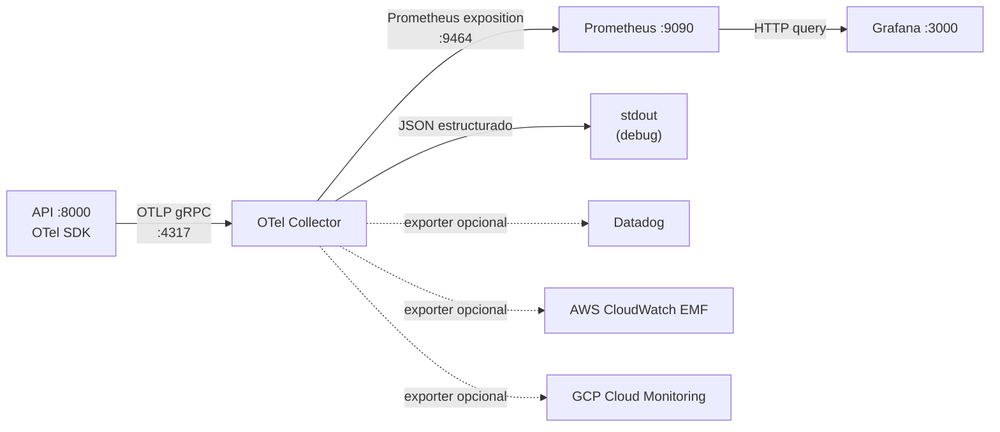

# Monitorización

## Flujo de telemetría



El Collector actúa de puente: recibe OTLP Push desde la API, expone métricas en formato Prometheus Pull y conserva logging para depuración o exportación SaaS.

## Acceso local

| URL | Servicio |
|---|---|
| http://localhost:3000 | Grafana — dashboards y datasource provisionados |
| http://localhost:5000 | MLflow — tracking UI + Model Registry |
| http://localhost:9090 | Prometheus — consultas TSDB y estado del scrape |
| http://localhost:55679 | OTel Collector zPages — debug de pipelines y exporters |
| http://localhost:4317 | OTLP gRPC receiver (uso interno) |
| http://localhost:4318 | OTLP HTTP receiver (uso interno) |

---

## Métricas de la API (instrumentos OTel)

Todas las métricas usan el prefijo `pipeline.` con separador de punto (convención OTel).
El OTel Collector prometheus exporter convierte puntos en guiones bajos y añade el sufijo `_total` a los contadores. Los nombres OTel **no** incluyen `_total` (ese sufijo es exclusivo de Prometheus).

| Nombre OTel (SDK) | Nombre Prometheus (tras exporter) | Tipo | Atributos | Descripción |
|---|---|---|---|---|
| `pipeline.model.loaded` | `pipeline_model_loaded` | ObservableGauge | — | `1` cuando el modelo está cargado, `0` durante hot-swap |
| `pipeline.inference.requests` | `pipeline_inference_requests_total` | Counter | `status={ok,error}` | Total de peticiones de inferencia |
| `pipeline.inference.latency_seconds` | `pipeline_inference_latency_seconds_bucket/sum/count` | Histogram | `status={ok,error}` | Latencia end-to-end del endpoint `/infer/` |
| `pipeline.training.requests` | `pipeline_training_requests_total` | Counter | `status={ok,error}` | Total de peticiones de entrenamiento |
| `pipeline.training.samples` | `pipeline_training_samples_total` | Counter | — | Total de muestras procesadas con `partial_fit` |
| `pipeline.data.drift_score` | `pipeline_data_drift_score` | ObservableGauge | `feature={nombre}` | Score de drift por feature (EMA, rango 0–∞) |
| `pipeline.version.switches` | `pipeline_version_switches_total` | Counter | `status={ok,error}` | Total de cambios de versión via MLflow |
| `pipeline.model.load_duration_seconds` | `pipeline_model_load_duration_seconds_bucket/sum/count` | Histogram | — | Tiempo de carga de artefacto MLflow en cada version switch |

> **Regla de naming**: El OTel SDK exporta los contadores como Sum monotónico sin sufijo `_total`. El exporter prometheus del OTel Collector añade `_total` automáticamente. Si el nombre OTel incluye `_total`, algunos versiones del collector producen `_total_total` en Prometheus. Por eso los nombres OTel en `metrics.py` no incluyen el sufijo.

### Atributo `feature` del drift score

Las 30 features del dataset breast cancer se usan como atributo `feature`:

```
radius_mean    texture_mean    perimeter_mean  area_mean
smoothness_mean  compactness_mean  concavity_mean  concpts_mean
symmetry_mean  fracdim_mean
radius_se      texture_se      perimeter_se    area_se
smoothness_se  compactness_se  concavity_se    concpts_se
symmetry_se    fracdim_se
radius_worst   texture_worst   perimeter_worst area_worst
smoothness_worst  compactness_worst  concavity_worst  concpts_worst
symmetry_worst fracdim_worst
```

---

## Trazas distribuidas

`FastAPIInstrumentor` inyecta tramos OTel en cada request HTTP automáticamente. Las trazas incluyen:

- `http.method`, `http.route`, `http.status_code`
- `service.name` = `pipeline-api` (configurable via `OTEL_SERVICE_NAME`)
- `service.version` = `IMAGE_TAG` enriquecido por el resource processor del Collector

---

## Configuración del servidor MLflow (artifact proxy)

El servidor MLflow debe arrancar con `--artifacts-destination` + `--serve-artifacts` para que el cliente Python suba artefactos via HTTP en lugar de acceso directo al filesystem:

```yaml
command: >
  mlflow server
    --backend-store-uri sqlite:////mlflow/mlflow.db
    --artifacts-destination /mlflow/artifacts
    --serve-artifacts
    --host 0.0.0.0
    --port 5000
```

**Migración desde `--default-artifact-root`**: Si el stack arrancó previamente sin `--serve-artifacts`, los experimentos MLflow en la DB tienen `artifact_location` como path local. El código de `_push_to_registry()` detecta esto, hace soft-delete del experimento y fuerza su recreación con URI proxy `mlflow-artifacts:/`. Si el soft-delete deja el nombre bloqueado, ejecutar en el contenedor mlflow:

```bash
docker exec pipeline_mlflow mlflow gc --backend-store-uri sqlite:////mlflow/mlflow.db
```

---

## Configuración del Collector, más un exporter Prometheus para el pipeline de métricas

El archivo `monitoring/otel-collector/otel-collector.yml` define tres pipelines (metrics, traces, logs) con los mismos receivers y processors:

```yaml
processors:
  resource:
    attributes:
      - key: deployment.environment
        value: ${env:DEPLOY_ENV:-local}
        action: upsert
      - key: service.version
        value: ${env:IMAGE_TAG:-dev}
        action: upsert

exporters:
  prometheus:
    endpoint: 0.0.0.0:9464
    resource_to_telemetry_conversion:
      enabled: true
```

### Activar exporters SaaS

1. Descomentar el bloque del exporter deseado en `otel-collector.yml`.
2. Añadir su nombre a la lista `exporters` del pipeline correspondiente.
3. Definir las variables de entorno en `.env`:

| Backend | Variable requerida |
|---|---|
| Datadog | `DATADOG_API_KEY`, `DD_SITE` |
| AWS CloudWatch EMF | `AWS_ACCESS_KEY_ID`, `AWS_SECRET_ACCESS_KEY`, `AWS_DEFAULT_REGION` |
| GCP Cloud Monitoring | `GOOGLE_APPLICATION_CREDENTIALS`, `GCP_PROJECT_ID` |

Con Prometheus y Grafana locales, las alertas pueden definirse en Grafana o en reglas de Prometheus. Base recomendada:

| Alerta | Regla Prometheus |
|---|---|
| `ModelNotLoaded` | `pipeline_model_loaded == 0` durante > 1 min |
| `HighInferenceErrorRate` | `sum(rate(pipeline_inference_requests_total{status="error"}[5m])) / sum(rate(pipeline_inference_requests_total[5m])) > 0.05` |
| `HighInferenceLatencyP95` | `histogram_quantile(0.95, sum(rate(pipeline_inference_latency_seconds_bucket[5m])) by (le)) > 0.5` |
| `DataDriftDetected` | `pipeline_data_drift_score > 0.5` en cualquier feature durante > 5 min |
| `HighVersionSwitchErrors` | `sum(rate(pipeline_version_switches_total{status="error"}[5m])) > 0` |

---

## Cómo se produce el drift en inferencia

El `DriftTracker` singleton recibe actualizaciones de dos orígenes:

| Origen | Método | Cuándo emite |
|---|---|---|
| `POST /train/` | `update_batch(features)` | Inmediatamente después de cada batch |
| `POST /infer/` | `update_single(feature_vec)` | Después de cada 50 peticiones de inferencia |

La actualización EMA (α = 0.05) actualiza la referencia de forma suave. Un desplazamiento brusco como el que genera el seeder (> 2σ) eleva `pipeline.data.drift_score` a valores > 0.5.

---

## Simular drift manualmente

```powershell
$env:API_URL             = "http://localhost:8000"
$env:DRIFT_ONSET_AFTER_S = "0"
$env:DRIFT_MAGNITUDE     = "3.0"
.venv\Scripts\python services\seeder\seeder.py
```

En unos segundos, `pipeline.data.driftgue activo y vuelca JSON estructurado a stdout, mientras que el exporter `prometheus` publica el scrape endpoint en `:9464``concavity_worst`.

---

## Flujo completo entre servicios

```
Seeder
  └─► POST /infer/ ──────────────────────────────────────────────────►  OTel Counter: pipeline.inference.requests
  └─► POST /train/ ──► partial_fit ──► model.pkl (disco) ────────────►  OTel Counter: pipeline.training.samples
                                                                         OTel Counter: pipeline.training.requests
Frontend / Operador
  └─► POST /version/register ──► joblib.load(model.pkl)
                               ──► mlflow.sklearn.log_model() ────────►  MLflow Registry: nueva versión N
  └─► POST /version/switch {"model_ref": "N"}
                               ──► mlflow.sklearn.load_model() ────────►  OTel Histogram: pipeline.model.load_duration_seconds
                                                                          OTel Counter:   pipeline.version.switches

OTel Collector :4317 (gRPC) ──► Prometheus exporter :9464
Prometheus :9090 ──► scrape otel-collector:9464 (cada 15s)
Grafana :3000 ──► query Prometheus ──► dashboards en vivo
```

**Secuencia de arranque recomendada:**

1. `python manage.py setup` — entrena el modelo bootstrap, lo registra en MLflow como versión 1, guarda `model/weights/model.pkl`
2. `python manage.py start` — levanta el stack completo (`docker compose up --build -d`)
3. El seeder genera ~20 req/s de inferencia y un batch de training cada 30s automáticamente
4. Verificar: `http://localhost:9090/graph` → `pipeline_inference_requests_total` debe aparecer en <30s
5. Para registrar un modelo entrenado incrementalmente: Frontend → Versioning → **Register to MLflow**
6. Para hacer hot-swap: Frontend → Versioning → Switch version → número de versión devuelto en paso 5

**Nuevo endpoint `POST /version/register`:**

Registra el modelo actualmente en memoria (cargado desde `model.pkl`) en el MLflow Model Registry como una nueva versión. Permite un ciclo completo sin reiniciar el servicio:

```
train (partial_fit, mejora el modelo) → register (sube a MLflow) → switch (carga la nueva versión)
```

---

## Verificar telemetría sin SaaS

El exporter `logging` del Collector siempre está activo y vuelca JSON estructurado a stdout:

```bash
docker compose logs otel-collector --follow
```

Cada línea de log es un `ResourceMetrics` o `ResourceSpans` completo, ingestable sin agente por CloudWatch Log Insights, GCP Logging y Datadog Log Management.
