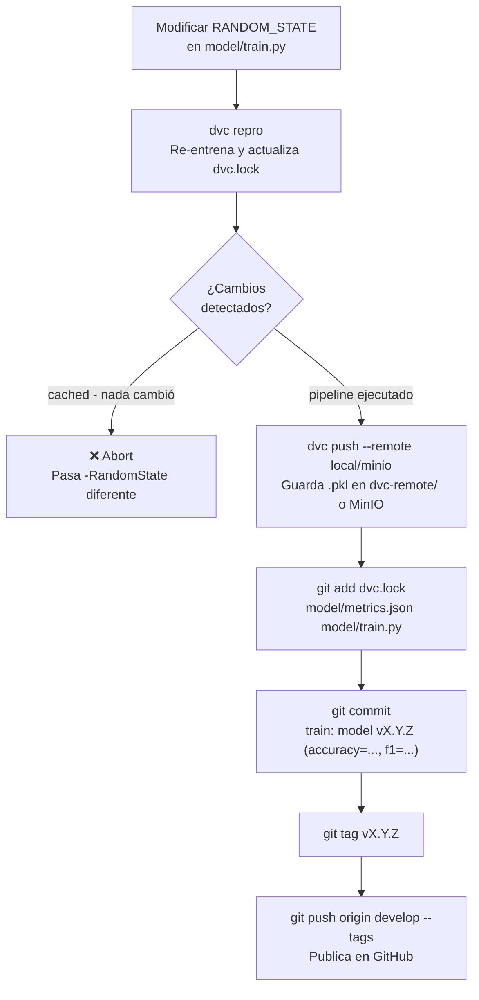
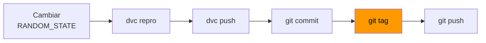

# Versionado de modelos (DVC + Git)

El sistema combina **Git** (para código y metadatos) con **DVC** (para artefactos binarios).  
Git rastrea `dvc.lock` y `metrics.json`; el `.pkl` vive en `dvc-remote/` o en **MinIO** fuera del repositorio.

---

## Flujo con `pipeline.ps1 train`

Un único comando ejecuta el flujo completo:

```powershell
.\pipeline.ps1 train -Version v2.1.0 -RandomState 7
```

Internamente hace:



### Parámetros disponibles

| Parámetro | Descripción | Ejemplo |
|---|---|---|
| `-Version` | Tag semántico (obligatorio) | `v2.1.0` |
| `-RandomState` | Nuevo valor de `RANDOM_STATE` en `train.py` | `7` |
| `-Remote` | Remote DVC destino: `local` o `minio` | `minio` |

```powershell
# Remote local (por defecto)
.\pipeline.ps1 train -Version v2.0.0 -RandomState 42

# Remote MinIO (requiere docker compose up minio)
.\pipeline.ps1 train -Version v2.1.0 -RandomState 7 -Remote minio

# Diferente random state, remote local
.\pipeline.ps1 train -Version v2.2.0 -RandomState 99
```

> **Importante:** si no cambias `RANDOM_STATE`, DVC usará su caché y el script abortará. El dataset es fijo (`breast_cancer`), por lo que el único parámetro configurable para forzar re-entrenamiento es `-RandomState`.

---

## Regla de oro



El tag debe crearse **después** del commit que contiene el `dvc.lock` actualizado.

---

## Parámetros DVC rastreados

```yaml
# dvc.yaml
params:
  - model/train.py:
      - DATASET        # "breast_cancer" (fijo)
      - N_FEATURES     # 30 (fijo por el dataset)
      - RANDOM_STATE   # variable — cambia para forzar re-entrenamiento
```

---

## Remotes DVC

| Remote | Tipo | Configuración | Cuándo usar |
|---|---|---|---|
| `local` | Directorio | `dvc-remote/` en la raíz | Desarrollo sin Docker |
| `minio` | S3-compatible | `s3://dvc-artifacts` en `localhost:9000` | Simula almacenamiento de producción |

```powershell
# Listar remotes configurados
.venv\Scripts\dvc remote list

# Pull desde un remote específico
.venv\Scripts\dvc pull --remote local
.venv\Scripts\dvc pull --remote minio
```

---

## Flujo manual (sin script)

Para casos avanzados (cambiar arquitectura, hiperparámetros, etc.):

```powershell
# 1. Modificar model/train.py

# 2. Reproducir el pipeline DVC
.venv\Scripts\dvc repro

# 3. Subir el artefacto
.venv\Scripts\dvc push --remote local    # o --remote minio

# 4. Commitear metadatos
git add dvc.lock model/metrics.json model/train.py
git commit -m "train: model vX.Y.Z"

# 5. Tagear y publicar
git tag vX.Y.Z
git push origin develop --tags
```

---

## Cambiar a una versión anterior (hot-swap)

### Desde el frontend

http://localhost:8501 → tab **Version Control** → escribe el tag → *Switch Version*.

### Desde la API

```powershell
Invoke-RestMethod -Method Post http://localhost:8000/version/switch `
    -ContentType "application/json" `
    -Body '{"git_ref": "v2.0.0"}'
```

El endpoint ejecuta:
1. `git checkout v2.0.0 -- .dvc`
2. `git checkout v2.0.0 -- dvc.lock`
3. `dvc pull --force --remote local`
4. `SKLearnPredictor.load(model.pkl)`
5. Registra `pipeline_model_load_duration_seconds`

El modelo se recarga **sin reiniciar la API**.

---

## Restaurar un artefacto localmente

```powershell
git checkout v2.0.0 -- dvc.lock
.venv\Scripts\dvc pull --force --remote local
```

Esto descarga exactamente el `.pkl` que corresponde a `v2.0.0`.

---

## Ver métricas por versión

```powershell
# Comparar dos versiones
.venv\Scripts\dvc metrics diff v2.0.0 v2.1.0

# Ver métricas de la versión actual
.venv\Scripts\dvc metrics show
```

---

## Consultar versiones publicadas

```powershell
git tag -l              # listar tags locales
git ls-remote --tags origin  # listar tags en GitHub
```
