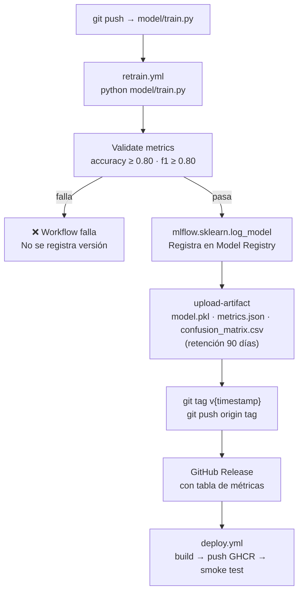

# Versionado de modelos (MLflow Model Registry + GitHub Actions)

El sistema utiliza **MLflow Model Registry** como fuente de verdad para artefactos de modelo y **GitHub Actions** para automatizar el ciclo de reentrenamiento y despliegue. Git rastrea código y métricas; el `.pkl` canónico vive en el registry.

---

## Flujo automatizado con GitHub Actions

Un push a `model/train.py` o `model/requirements.txt` en `master` dispara el pipeline completo:



### Disparadores disponibles

| Trigger | Cuándo |
|---|---|
| `push` en `model/train.py` o `model/requirements.txt` | Automático en cada cambio de código de entrenamiento |
| `schedule` (lunes 02:00 UTC) | Refresco semanal de baseline |
| `workflow_dispatch` | Manual desde GitHub Actions UI con umbrales personalizables |

### Umbrales de validación

```yaml
# workflow_dispatch inputs (defaults)
min_accuracy: "0.80"
min_f1:       "0.80"
```

---

## Flujo manual de entrenamiento

```powershell
# 1. Modificar model/train.py si es necesario

# 2. Entrenar localmente
.venv\Scripts\python model/train.py

# 3. Revisar métricas
Get-Content model/metrics.json | ConvertFrom-Json

# 4. Commitear y publicar (dispara retrain.yml automáticamente)
git add model/train.py model/metrics.json
git commit -m "train: ajuste de hiperparámetros"
git push origin master
```

---

## MLflow Model Registry

### Ver versiones registradas

```powershell
# Via MLflow CLI
.venv\Scripts\mlflow models list --name pipeline-model

# Via Python
python -c "
import mlflow
mlflow.set_tracking_uri('http://localhost:5000')
client = mlflow.tracking.MlflowClient()
for v in client.search_model_versions(\"name='pipeline-model'\"):
    print(v.version, v.current_stage, v.run_id[:8])
"
```

### Aliases disponibles

MLflow Model Registry usa aliases para identificar versiones de forma semántica:

| Alias | Descripción |
|---|---|
| `Production` | Versión activa en producción |
| `Staging` | Versión candidata en validación |
| `1`, `2`, `3`… | Número de versión absoluto |

### Promover una versión a producción

```python
import mlflow
mlflow.set_tracking_uri("http://localhost:5000")
client = mlflow.tracking.MlflowClient()
client.set_registered_model_alias("pipeline-model", "Production", version="3")
```

---

## Cambiar a una versión en caliente (hot-swap)

El modelo se recarga sin reiniciar la API.

### Desde el frontend

http://localhost:8501 → tab **Version Control** → escribe el `model_ref` → *Switch Version*.

### Desde la API

```powershell
# Por alias MLflow
Invoke-RestMethod -Method Post http://localhost:8000/version/switch `
    -ContentType "application/json" `
    -Body '{"model_ref": "Production"}'

# Por número de versión
Invoke-RestMethod -Method Post http://localhost:8000/version/switch `
    -ContentType "application/json" `
    -Body '{"model_ref": "2"}'
```

### Consultar versión activa

```powershell
Invoke-RestMethod http://localhost:8000/version/current
```

El endpoint devuelve el `model_ref` con el que se cargó la versión actual.

---

## Comparar métricas entre versiones

```python
import mlflow

mlflow.set_tracking_uri("http://localhost:5000")
client = mlflow.tracking.MlflowClient()

for version in ["1", "2"]:
    mv = client.get_model_version("pipeline-model", version)
    run = client.get_run(mv.run_id)
    print(f"v{version}:", run.data.metrics)
```

---

## Consultar versiones publicadas

```powershell
# Tags Git (cada reentrenamiento en master crea un tag v{timestamp})
git tag -l "v*"
git ls-remote --tags origin

# GitHub Releases (incluyen tabla de métricas y artefactos adjuntos)
gh release list
gh release view v20260511020000
```

---

## Rollback manual

```powershell
# 1. Identificar la versión anterior en MLflow UI (http://localhost:5000)
# 2. Hot-swap via API
Invoke-RestMethod -Method Post http://localhost:8000/version/switch `
    -ContentType "application/json" `
    -Body '{"model_ref": "1"}'

# 3. Opcionalmente, promover esa versión a Production en el registry
python -c "
import mlflow
mlflow.set_tracking_uri('http://localhost:5000')
mlflow.tracking.MlflowClient().set_registered_model_alias('pipeline-model', 'Production', '1')
"
```
