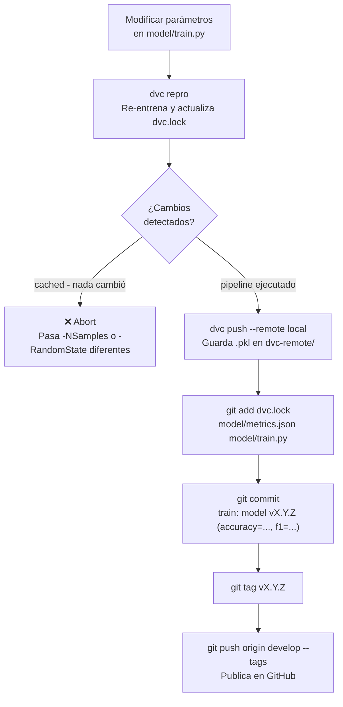
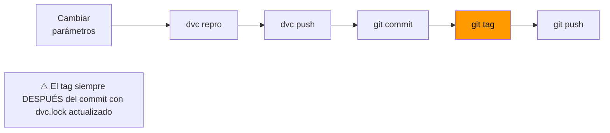

# Versionado de modelos (DVC + Git)

El sistema combina **Git** (para código y metadatos) con **DVC** (para artefactos binarios).  
Git rastrea `dvc.lock` y `metrics.json`; el `.pkl` vive en `dvc-remote/` fuera del repositorio.

---

## Flujo con `pipeline.ps1 train`

Un único comando ejecuta el flujo completo:

```powershell
.\pipeline.ps1 train -Version v1.3.0 -NSamples 8000
```

Internamente hace:



### Parámetros disponibles

| Parámetro | Descripción | Ejemplo |
|---|---|---|
| `-Version` | Tag semántico (obligatorio) | `v1.3.0` |
| `-NSamples` | Nuevo valor de `N_SAMPLES` en `train.py` | `8000` |
| `-RandomState` | Nuevo valor de `RANDOM_STATE` en `train.py` | `99` |

```powershell
.\pipeline.ps1 train -Version v1.3.0 -NSamples 8000
.\pipeline.ps1 train -Version v1.4.0 -RandomState 99
.\pipeline.ps1 train -Version v2.0.0 -NSamples 10000 -RandomState 7
```

> **Importante:** si no cambias ningún parámetro, DVC usará su caché y el script abortará. Siempre pasa al menos `-NSamples` o `-RandomState` con un valor diferente al actual.

---

## Regla de oro



El tag debe crearse **después** del commit que contiene el `dvc.lock` actualizado.

---

## Flujo manual (sin script)

Para casos avanzados o modificaciones más allá de `N_SAMPLES` y `RANDOM_STATE`:

```powershell
# 1. Modificar model/train.py (arquitectura, features, hiperparámetros...)

# 2. Reproducir el pipeline DVC
.venv\Scripts\dvc repro

# 3. Subir el artefacto al remote local
.venv\Scripts\dvc push --remote local

# 4. Commitear metadatos
git add dvc.lock model/metrics.json model/train.py
git commit -m "train: model vX.Y.Z"

# 5. Tagear y publicar
git tag vX.Y.Z
git push origin develop --tags
```

---

## Cambiar a una versión anterior (hot-swap)

### Desde el frontend

http://localhost:8501 → sección **Model Version Control** → escribe el tag → *Switch Version*.

### Desde la API

```bash
curl -X POST http://localhost:8000/version/switch \
  -H "Content-Type: application/json" \
  -d '{"git_ref": "v1.0.0"}'
```

### Desde PowerShell

```powershell
Invoke-RestMethod -Method Post http://localhost:8000/version/switch `
  -ContentType "application/json" `
  -Body '{"git_ref": "v1.0.0"}'
```

El endpoint ejecuta `git checkout <ref> -- .dvc && dvc pull --force`. El modelo se recarga sin reiniciar la API.

---

## Restaurar un artefacto localmente

```powershell
git checkout v1.0.0 -- dvc.lock
.venv\Scripts\dvc pull --force --remote local
```

Esto descarga exactamente el `.pkl` que corresponde a `v1.0.0`.

---

## Ver métricas por versión

```powershell
# Comparar dos versiones
.venv\Scripts\dvc metrics diff v1.0.0 v1.2.0

# Ver métricas de la versión actual
.venv\Scripts\dvc metrics show
```

---

## Versiones publicadas en GitHub

Los tags semánticos son visibles en la página **Releases** / **Tags** del repositorio.  
Cada tag tiene en su commit el `dvc.lock` que apunta al artefacto exacto.

```powershell
git tag -l          # listar tags locales
git ls-remote --tags origin  # listar tags en GitHub
```
