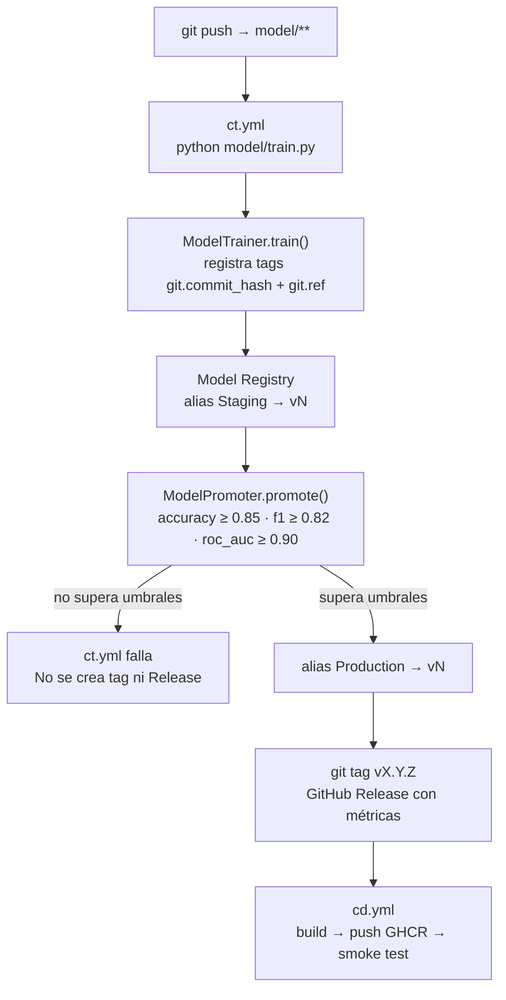

# Versionado de modelos

MLflow Model Registry es la fuente de verdad para artefactos de modelo. GitHub Actions automatiza el ciclo de reentrenamiento y despliegue. Git rastrea código; el modelo canónico vive en el registry.

---

## Clases de entrenamiento y promoción

### `ModelTrainer` (`model/trainer.py`)

Encapsula el ciclo completo de entrenamiento:

```python
trainer = ModelTrainer(
    tracking_uri="http://localhost:5000",
    experiment="pipeline-breast-cancer",
    model_name="pipeline-model",
)
result = trainer.train(git_commit="04429b4", git_ref="develop")
# result.version  → "4"
# result.metrics  → {"accuracy": 0.9737, "f1": 0.9790, "roc_auc": 0.9947, ...}
```

**Qué registra en MLflow por run:**

| Tipo | Claves |
|---|---|
| Params | `model_class`, `loss`, `max_iter`, `random_state`, `dataset`, `n_features` |
| Metrics | `accuracy`, `f1`, `precision`, `recall`, `roc_auc` |
| Tags | `git.commit_hash`, `git.ref`, `environment`, `pipeline.version` |
| Artifact | Pipeline `StandardScaler + SGDClassifier` serializado |

El modelo queda registrado con alias `Staging` inmediatamente tras el entrenamiento.

#### Enriquecimiento de metadatos en el Model Registry

Tras asignar el alias `Staging`, `_register()` escribe una descripción profesional y cuatro tags a nivel de versión:

| Metadato | Método MLflow | Contenido |
|---|---|---|
| Descripción | `update_model_version(description=...)` | Dataset, run ID, timestamp de registro y resumen de métricas |
| `run_id` | `set_model_version_tag` | UUID del run de MLflow asociado |
| `registered_at` | `set_model_version_tag` | Timestamp ISO UTC del registro |
| `model_name` | `set_model_version_tag` | Nombre del modelo en el registry |
| `alias` | `set_model_version_tag` | Siempre `Staging` en el registro inicial |

Ejemplo de descripción generada:
```
SGDClassifier · StandardScaler pipeline trained on Breast Cancer Wisconsin (569 samples, 30 features).
Run ID: ef58985930e6...
Registered: 2026-05-18T10:00:00.000000+00:00
Metrics: accuracy=0.9737 | f1=0.9790 | precision=0.9859 | recall=0.9722 | roc_auc=0.9947
```

### `ModelPromoter` (`model/promote.py`)

Promueve `Staging` → `Production` si todas las métricas superan los umbrales:

```python
promo = ModelPromoter(
    tracking_uri="http://localhost:5000",
    model_name="pipeline-model",
    thresholds={"accuracy": 0.85, "f1": 0.82, "roc_auc": 0.90},
).promote(version="4")
# promo.promoted → True
# promo.reason   → "all thresholds met"
```

La operación es idempotente: `set_registered_model_alias` sobrescribe el alias `Production` sin duplicar versiones. Tras asignar el alias, escribe el tag `promoted_at` con el timestamp ISO UTC de la promoción.

---

## Flujo automatizado (GitHub Actions)

Un push a `model/**` en `master` dispara el pipeline completo:



---

## Flujo manual de entrenamiento

```powershell
# Entrenar localmente apuntando al stack Docker
$env:MLFLOW_TRACKING_URI = "http://localhost:5000"
$env:MLFLOW_MODEL_NAME   = "pipeline-model"

cd model
..\venv\Scripts\python train.py
```

Output esperado:
```
version=4 run_id=ef58985930e6...
promoted=True reason=all thresholds met
metric.accuracy=0.9737
metric.f1=0.9790
metric.precision=0.9859
metric.recall=0.9722
metric.roc_auc=0.9947
```

---

## MLflow Model Registry

### Ver versiones y aliases

```python
import mlflow
from mlflow.tracking import MlflowClient

mlflow.set_tracking_uri("http://localhost:5000")
client = MlflowClient()

for v in client.search_model_versions("name='pipeline-model'"):
    print(v.version, v.aliases, v.run_id[:8])

prod = client.get_model_version_by_alias("pipeline-model", "Production")
print("Production →", prod.version)
```

### Aliases disponibles

| Alias | Descripción |
|---|---|
| `Production` | Versión activa — asignada por `ModelPromoter` si supera umbrales |
| `Staging` | Candidata — asignada por `ModelTrainer` tras cada entrenamiento |
| `1`, `2`, `3`… | Número de versión absoluto |

### Comparar métricas entre versiones

```python
for version in ["3", "4"]:
    mv = client.get_model_version("pipeline-model", version)
    run = client.get_run(mv.run_id)
    print(f"v{version}:", run.data.metrics)
    print(f"  git.ref={run.data.tags.get('git.ref')}",
          f"  commit={run.data.tags.get('git.commit_hash', '')[:8]}")
```

---

## Hot-swap de versiones (sin reiniciar la API)

### Desde el frontend

`http://localhost:8501` → tab **Version Control** → introduce `model_ref` → *Switch Version*.

### Desde la API

```powershell
# Por alias
Invoke-RestMethod -Method Post http://localhost:8000/version/switch `
    -ContentType "application/json" `
    -Body '{"model_ref": "Production"}'

# Por número de versión
Invoke-RestMethod -Method Post http://localhost:8000/version/switch `
    -ContentType "application/json" `
    -Body '{"model_ref": "2"}'

# Consultar versión activa
Invoke-RestMethod http://localhost:8000/version/current
```

---

## Rollback

```powershell
# 1. Identificar la versión anterior en MLflow UI (http://localhost:5000)

# 2. Hot-swap inmediato via API
Invoke-RestMethod -Method Post http://localhost:8000/version/switch `
    -ContentType "application/json" `
    -Body '{"model_ref": "3"}'

# 3. Reasignar alias Production en el registry
python -c "
import mlflow
mlflow.set_tracking_uri('http://localhost:5000')
mlflow.tracking.MlflowClient().set_registered_model_alias('pipeline-model', 'Production', '3')
"
```

El modelo en memoria se preserva si MLflow es inalcanzable durante el switch.

### Comportamiento esperado ante referencias inexistentes

`POST /version/switch` con un `model_ref` que no existe en el MLflow Model Registry retorna **HTTP 500**. Esto es el comportamiento correcto: la API intenta cargar el artefacto desde MLflow, obtiene una excepción del cliente MLflow, preserva el modelo activo en memoria y registra `pipeline.version.switches{status="error"}`. No retorna 404 porque la operación de carga falla en tiempo de ejecución, no en la validación del input.

| `model_ref` | Resultado HTTP | Motivo |
|---|---|---|
| Vacío o ausente | 422 | Validación Pydantic — campo requerido |
| Referencia inexistente en MLflow | 500 | Excepción del cliente MLflow durante la carga |
| Número de versión válido | 200 | Hot-swap completado |
| Alias válido (`Production`, `Staging`) | 200 | MLflow resuelve alias a versión concreta |

---

## Consultar versiones publicadas

```powershell
# Tags Git semánticos (creados automáticamente por ct.yml)
git tag -l "v*"
git ls-remote --tags origin

# GitHub Releases (incluyen tabla de métricas)
gh release list
gh release view v0.0.1
```
